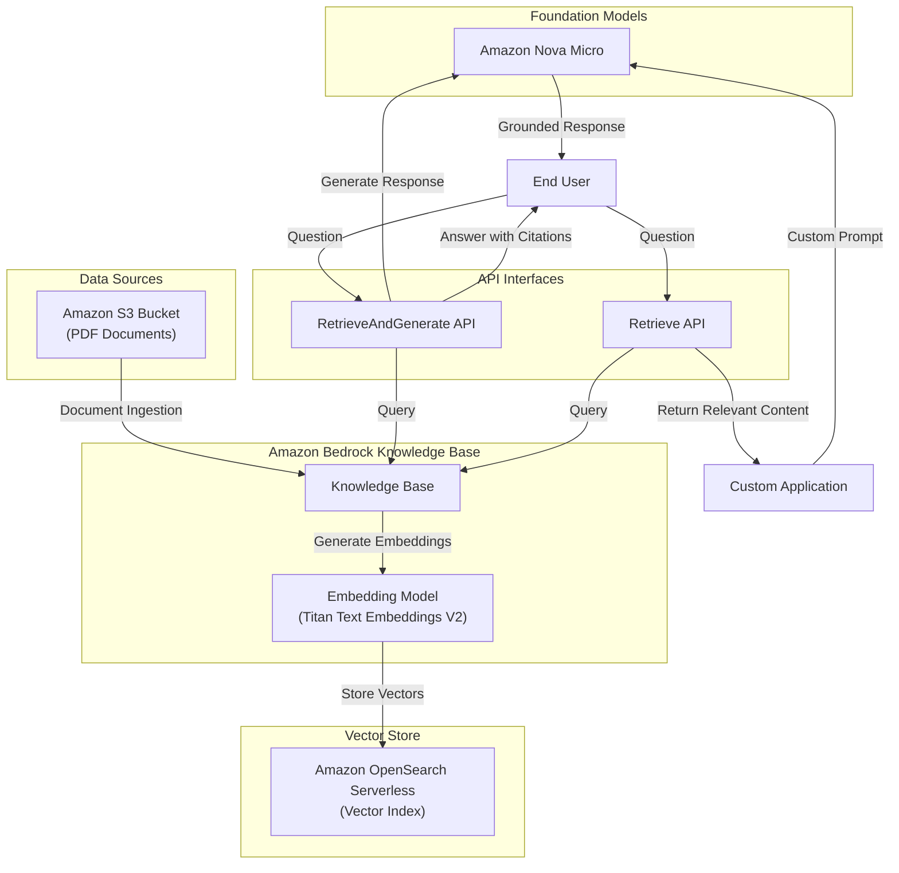

# Amazon Bedrock Knowledge Bases and RAG - Technical Summary

## Executive Summary

Amazon Bedrock Knowledge Bases (BKB) provides a fully managed solution for implementing Retrieval Augmented Generation (RAG) workflows. This module demonstrates how to create a knowledge base using Amazon Shareholder Letters as source documents, connect it to a vector store, and build question-answering applications using two different API approaches. The implementation showcases how RAG enhances foundation model responses by grounding them in specific, relevant information retrieved from your own data sources.

## Technical Architecture Overview



## Implementation Details Breakdown

### 1. Environment Setup and Resource Creation

The implementation begins with setting up the necessary AWS resources:

- **S3 Bucket**: Created to store PDF documents (Amazon Shareholder Letters)
- **IAM Role and Policies**: Configured with permissions for:
  - Accessing S3 documents
  - Invoking embedding models
  - Interacting with OpenSearch Serverless
- **OpenSearch Serverless Collection**: Provisioned with:
  - Security policies (encryption, network, access)
  - Vector index configuration using FAISS engine

Key code for IAM role creation:

```python
# Create IAM role with necessary permissions
bedrock_kb_execution_role = utility.create_bedrock_execution_role(bucket_name=s3_bucket_name)
bedrock_kb_execution_role_arn = bedrock_kb_execution_role['Role']['Arn']
```

Vector index configuration:

```python
index_definition = {
   "settings": {
      "index.knn": "true",
       "number_of_shards": 1,
       "knn.algo_param.ef_search": 512,
       "number_of_replicas": 0,
   },
   "mappings": {
      "properties": {
         "vector": {
            "type": "knn_vector",
            "dimension": embedding_model_dim,
             "method": {
                 "name": "hnsw",
                 "engine": "faiss",
                 "space_type": "l2"
             },
         },
         "text": { "type": "text" },
         "text-metadata": { "type": "text" }
      }
   }
}
```

### 2. Knowledge Base Creation and Document Ingestion

The workflow for creating and populating the knowledge base involves:

1. **Knowledge Base Configuration**: Specifying the embedding model and storage configuration
2. **Data Source Connection**: Linking to the S3 bucket containing documents
3. **Chunking Configuration**: Defining how documents are split into manageable pieces
4. **Ingestion Process**: Extracting content, generating embeddings, and storing in vector index

Key code for knowledge base creation:

```python
# Vector Storage Configuration
storage_config = {
    "type": "OPENSEARCH_SERVERLESS",
    "opensearchServerlessConfiguration": {
        "collectionArn": aoss_collection["createCollectionDetail"]['arn'],
        "vectorIndexName": aoss_index_name,
        "fieldMapping": {
            "vectorField": "vector",
            "textField": "text",
            "metadataField": "text-metadata"
        }
    }
}

# Knowledge Base Configuration
knowledge_base_config = {
    "type": "VECTOR",
    "vectorKnowledgeBaseConfiguration": {
        "embeddingModelArn": embedding_model_arn
    }
}

response = bedrock_agent_client.create_knowledge_base(
    name=bedrock_kb_name,
    description="Amazon shareholder letter knowledge base.",
    roleArn=bedrock_kb_execution_role_arn,
    knowledgeBaseConfiguration=knowledge_base_config,
    storageConfiguration=storage_config)
```

Chunking configuration for document processing:

```python
vector_ingestion_config = {
    "chunkingConfiguration": {
        "chunkingStrategy": "FIXED_SIZE",
        "fixedSizeChunkingConfiguration": {
            "maxTokens": 512,
            "overlapPercentage": 20
        }
    }
}
```

### 3. Fully-Managed RAG with RetrieveAndGenerate API

The `RetrieveAndGenerate` API provides a streamlined approach to RAG:

1. User query is automatically converted to vector embeddings
2. Relevant document chunks are retrieved from the knowledge base
3. Retrieved content is injected into the foundation model's prompt
4. Model generates a response with source citations

Implementation code:

```python
response = bedrock_agent_client.retrieve_and_generate(
    input={
        'text': user_query
    },
    retrieveAndGenerateConfiguration={
        'type': 'KNOWLEDGE_BASE',
        'knowledgeBaseConfiguration': {
            'knowledgeBaseId': bedrock_kb_id,
            'modelArn': model_arn
        }
    }
)
```

The response includes:
- Generated text answer
- Citations with source documents
- Relevance scores for retrieved content

### 4. Custom RAG with Retrieve API

The `Retrieve` API offers more flexibility by separating retrieval from generation:

1. User query is processed to retrieve relevant document chunks
2. Developer constructs a custom prompt incorporating retrieved content
3. Prompt is sent to foundation model via Converse API
4. Model generates a response based on the custom prompt

Retrieve API implementation:

```python
def retrieve(user_query, kb_id, num_of_results=5):
    return bedrock_agent_client.retrieve(
        retrievalQuery= {
            'text': user_query
        },
        knowledgeBaseId=kb_id,
        retrievalConfiguration= {
            'vectorSearchConfiguration': {
                'numberOfResults': num_of_results,
                'overrideSearchType': "HYBRID", # optional
            }
        }
    )
```

Custom prompt construction:

```python
# Extract all context from all relevant retrieved document chunks
contexts = [rr['content']['text'] for rr in response['retrievalResults']]

# Build Converse API request with system prompt and user prompt template
converse_request = {
    "system": [
        {"text": system_prompt}
    ],
    "messages": [
        {
            "role": "user",
            "content": [
                {
                    "text": user_prompt_template.format(contexts=contexts, user_query=user_query)
                }
            ]
        }
    ],
    "inferenceConfig": {
        "temperature": 0.4,
        "topP": 0.9,
        "maxTokens": 500
    }
}
```

## Key Takeaways and Lessons Learned

1. **Vector Search Flexibility**: Amazon Bedrock Knowledge Bases supports both semantic (vector-based) and hybrid (vector + keyword) search strategies, allowing optimization for different content types and query patterns.

2. **Chunking Strategy Impact**: The document chunking configuration (chunk size and overlap percentage) significantly affects retrieval quality. Smaller chunks provide more precise retrieval but may lack context, while larger chunks contain more context but may include irrelevant information.

3. **API Choice Tradeoffs**:
   - `RetrieveAndGenerate`: Offers simplicity and built-in citation handling but less control over prompt engineering
   - `Retrieve`: Provides maximum flexibility for custom RAG implementations but requires more development effort

4. **IAM Role Configuration**: Proper IAM role setup is critical, requiring specific permissions for:
   - S3 access (for document retrieval)
   - Bedrock model invocation (for embedding generation)
   - OpenSearch Serverless operations (for vector storage and retrieval)

5. **Resource Management**: The implementation includes proper cleanup procedures to avoid ongoing charges for unused resources.

## Technical Recommendations and Next Steps

1. **Production Deployment Considerations**:
   - Replace public internet access to OpenSearch Serverless with VPC endpoints for enhanced security
   - Implement monitoring and logging for knowledge base operations
   - Consider scaling parameters for high-traffic applications

2. **Performance Optimization**:
   - Experiment with different chunking strategies based on document types
   - Test various vector search configurations (k-NN parameters, relevance thresholds)
   - Benchmark different embedding models for domain-specific content

3. **Advanced RAG Techniques**:
   - Implement query rewriting to improve retrieval accuracy
   - Add multi-step reasoning for complex questions
   - Explore hybrid retrieval combining dense and sparse vectors

4. **Integration Opportunities**:
   - Connect to enterprise data sources (SharePoint, Confluence, databases)
   - Integrate with Amazon Bedrock Agents for task automation
   - Implement feedback loops to improve retrieval quality over time

5. **Security Enhancements**:
   - Add fine-grained access controls for different knowledge bases
   - Implement PII detection and redaction in retrieved content
   - Set up audit logging for compliance and governance

## Conclusion

Amazon Bedrock Knowledge Bases provides a powerful, fully-managed solution for implementing RAG workflows. The module demonstrates both the simplicity of the fully-managed approach with `RetrieveAndGenerate` API and the flexibility of custom implementations with the `Retrieve` API. By connecting foundation models to your organization's data, RAG enables more accurate, relevant, and trustworthy AI-generated responses while reducing hallucinations and providing source attribution.
