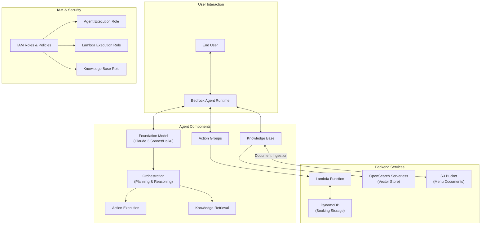
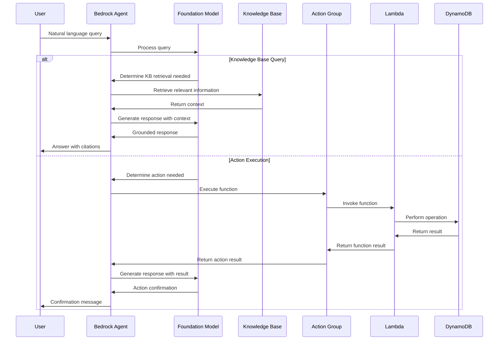

# Amazon Bedrock Agents - Technical Summary

## Executive Summary

Amazon Bedrock Agents is a capability that harnesses foundation models' reasoning skills to execute multi-step business tasks using natural language. This module demonstrates how to build an intelligent restaurant assistant that can handle table bookings and answer questions about the restaurant's menu. The implementation showcases the integration of action groups (for executing functions like creating and managing bookings) with knowledge bases (for retrieving information about restaurant menus), all orchestrated by a foundation model that provides natural language understanding and generation capabilities.

## Technical Architecture Overview



## Implementation Details Breakdown

### 1. Environment Setup and Resource Creation

The implementation begins with setting up the necessary AWS resources:

- **DynamoDB Table**: Created to store restaurant booking information with attributes like booking_id, date, name, hour, and num_guests
- **Lambda Function**: Implemented to handle booking-related operations (create, retrieve, delete)
- **IAM Roles and Policies**: Configured with specific permissions for agent execution, Lambda function execution, and knowledge base access

Key code for DynamoDB table creation:

```python
def create_dynamodb(table_name):
    try:
        table = dynamodb_resource.create_table(
            TableName=table_name,
            KeySchema=[
                {
                    'AttributeName': 'booking_id',
                    'KeyType': 'HASH'
                }
            ],
            AttributeDefinitions=[
                {
                    'AttributeName': 'booking_id',
                    'AttributeType': 'S'
                }
            ],
            BillingMode='PAY_PER_REQUEST'
        )
        # Wait for the table to be created
        table.wait_until_exists()
    except dynamodb_client.exceptions.ResourceInUseException:
        print(f'Table {table_name} already exists, skipping table creation step')
```

### 2. Agent Creation and Configuration

The agent is created with specific instructions and connected to a foundation model:

1. **Agent Definition**: Specifying name, description, and instructions
2. **Foundation Model Selection**: Using Claude 3 Sonnet or Haiku as the reasoning engine
3. **Action Group Creation**: Defining functions that the agent can execute

Key code for agent creation:

```python
response = bedrock_agent_client.create_agent(
    agentName=agent_name,
    agentResourceRoleArn=agent_role['Role']['Arn'],
    description=agent_description,
    idleSessionTTLInSeconds=1800,
    foundationModel=agent_foundation_model,
    instruction=agent_instruction,
)
```

Function schema definition for action groups:

```python
agent_functions = [
    {
        'name': 'get_booking_details',
        'description': 'Retrieve details of a restaurant booking',
        'parameters': {
            "booking_id": {
                "description": "The ID of the booking to retrieve",
                "required": True,
                "type": "string"
            }
        }
    },
    # Additional functions defined similarly
]
```

### 3. Knowledge Base Integration

The agent is enhanced with a knowledge base containing restaurant menu information:

1. **Knowledge Base Creation**: Setting up OpenSearch Serverless for vector storage
2. **Document Ingestion**: Uploading and processing menu PDFs from S3
3. **Agent-KB Association**: Connecting the knowledge base to the agent

Key code for knowledge base creation:

```python
kb = KnowledgeBasesForAmazonBedrock()
kb_id, ds_id = kb.create_or_retrieve_knowledge_base(
    knowledge_base_name, 
    knowledge_base_description, 
    bucket_name
)
```

Agent-KB association:

```python
response = bedrock_agent_client.associate_agent_knowledge_base(
    agentId=agent_id,
    agentVersion='DRAFT',
    description='Access the knowledge base when customers ask about the plates in the menu.',
    knowledgeBaseId=kb_id,
    knowledgeBaseState='ENABLED'
)
```

### 4. Agent Invocation and Interaction

The implementation demonstrates various ways to interact with the agent:

1. **Basic Queries**: Asking questions about restaurant menus
2. **Action Execution**: Creating, retrieving, and deleting bookings
3. **Contextual Conversations**: Maintaining context across multiple turns
4. **Session Attributes**: Providing additional context through prompt attributes

Key code for agent invocation:

```python
def invoke_agent_helper(query, session_id, agent_id, alias_id, enable_trace=False, session_state=None):
    end_session: bool = False
    if not session_state:
        session_state = {}

    # invoke the agent API
    agent_response = bedrock_agent_runtime_client.invoke_agent(
        inputText=query,
        agentId=agent_id,
        agentAliasId=alias_id,
        sessionId=session_id,
        enableTrace=enable_trace,
        endSession=end_session,
        sessionState=session_state
    )
    
    # Process and return response
    # ...
```

Example of using session attributes:

```python
session_state = {
    "promptSessionAttributes": {
        "name": "John",
        "today": today
    }
}
response = invoke_agent_helper(query, session_id, agent_id, alias_id, session_state=session_state)
```

### 5. Inline Agents (Bonus)

The module also introduces inline agents, which can be dynamically configured at runtime:

1. **Dynamic Configuration**: Modifying agent behavior on the fly
2. **Code Interpreter**: Incorporating Python code execution capabilities
3. **Trace Visualization**: Observing the agent's reasoning process

Key code for inline agent invocation:

```python
request_params = {
    "instruction": agent_instruction,
    "foundationModel": model_id,
    "sessionId": sessionId,
    "endSession": endSession,
    "enableTrace": enableTrace,
    "actionGroups": [code_interpreter_tool],
    "inputText": 'what is the time right now in pacific timezone?'
}

response = bedrock_rt_client.invoke_inline_agent(**request_params)
```

## Key Takeaways and Lessons Learned

1. **Agent Orchestration Flow**: Amazon Bedrock Agents use a sophisticated orchestration process where the foundation model:
   - Interprets user input
   - Plans necessary steps
   - Executes actions or retrieves information
   - Generates coherent responses

2. **Component Integration**: The power of agents comes from the seamless integration of:
   - Foundation models for reasoning and natural language understanding
   - Action groups for executing specific functions
   - Knowledge bases for retrieving relevant information
   - Session management for maintaining context

3. **IAM Role Configuration**: Proper IAM setup is critical, requiring specific permissions for:
   - Agent execution (invoking foundation models)
   - Knowledge base access (retrieve and retrieve-and-generate operations)
   - Lambda function execution (for action groups)

4. **Session Management**: Agents can maintain context across multiple interactions using:
   - Session IDs to track conversation history
   - Session attributes to provide additional context
   - Prompt attributes to influence agent behavior

5. **Multilingual Capabilities**: Foundation models can handle queries in multiple languages without explicit configuration, making agents inherently multilingual.

## Technical Recommendations and Next Steps

1. **Production Deployment Considerations**:
   - Implement proper error handling and retry mechanisms
   - Set up monitoring and logging for agent operations
   - Consider scaling parameters for high-traffic applications
   - Implement authentication and authorization for agent access

2. **Performance Optimization**:
   - Fine-tune agent instructions for more precise responses
   - Optimize knowledge base chunking for better retrieval
   - Implement caching mechanisms for frequently accessed information

3. **Advanced Agent Features**:
   - Implement guardrails for responsible AI usage
   - Explore advanced prompts for customizing agent behavior
   - Consider agent collaborations for complex workflows
   - Implement return of control for handling sensitive operations

4. **Integration Opportunities**:
   - Connect to additional enterprise systems beyond DynamoDB
   - Implement webhooks for real-time notifications
   - Integrate with messaging platforms for broader accessibility
   - Combine with analytics to gain insights from user interactions

5. **Security Enhancements**:
   - Implement fine-grained access controls for different agent capabilities
   - Add PII detection and redaction in agent responses
   - Set up audit logging for compliance and governance

## Agent Orchestration Sequence



## Conclusion

Amazon Bedrock Agents provides a powerful framework for building intelligent assistants that can understand natural language, reason through complex tasks, and execute actions on behalf of users. By combining foundation models with knowledge bases and action groups, developers can create contextually aware applications that maintain conversation history, adapt to user needs, and provide helpful responses across a wide range of scenarios.

The restaurant assistant example demonstrates how agents can be used to create practical applications that handle both information retrieval (menu questions) and transactional operations (booking management), showcasing the versatility and power of the Amazon Bedrock Agents platform.
