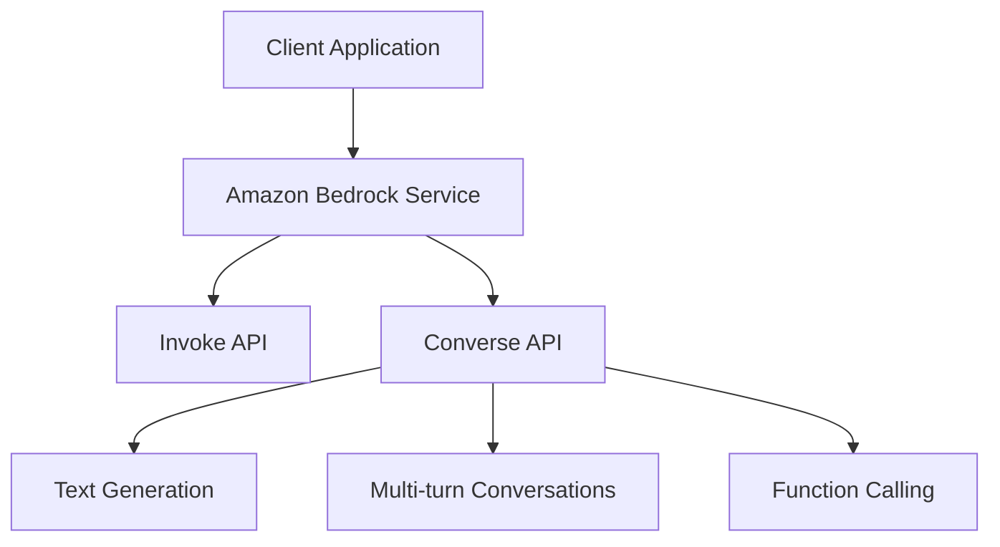

# Amazon Bedrock Workshop - 01_Text_generation Module Analysis

## Executive Summary

# Amazon Bedrock Workshop - Module 1 - Text Generation

## Implementation Details Breakdown

### Notebooks

- **01_text_and_code_generation_w_bedrock.ipynb**: 01 text and code generation w bedrock

### Key Code Samples

#### From 01_text_and_code_generation_w_bedrock.ipynb

```python
json\n",
    "{\n",
    "  \"modelId\": \"us.anthropic.claude-3-7-sonnet-20250219-v1:0\", // Required: Model identifier\n",
    "  \n",
    "  \"messages\": [ // Required: Conversation history\n",
    "    {\n",
    "      \"role\": \"user\", // Who sent the message\n",
    "      \"content\": [\n",
    "        {\n",
    "          \"text\": \"Your prompt or message here\" // Message content\n",
    "        }\n",
    "      ]\n",
    "    }\n",
    "  ],\n",
    "  \n",
    "  \"system\": [ //...
```

## Technical Architecture Overview



## Key Takeaways and Lessons Learned

1. **Module Focus**: This module demonstrates 01 Text generation capabilities in Amazon Bedrock.

2. **Integration Patterns**: The examples show how to integrate Amazon Bedrock services into applications.

3. **Best Practices**: The code demonstrates recommended patterns for working with Amazon Bedrock APIs.

## Recommendations and Next Steps

1. **Explore Further**: Experiment with different parameters and configurations to understand their impact.

2. **Combine Capabilities**: Consider how the capabilities demonstrated in this module can be combined with other Amazon Bedrock features.

3. **Production Considerations**: When moving to production, consider aspects like error handling, monitoring, and scaling.

