# Amazon Bedrock Workshop - Text Generation Module Analysis

## Executive Summary

The Text Generation module of the Amazon Bedrock Workshop provides a comprehensive introduction to Amazon Bedrock's text generation capabilities through its APIs. The module focuses on two primary APIs: the basic **Invoke API** and the more powerful **Converse API**. Through practical examples, the module demonstrates how to leverage foundation models (FMs) for various text generation tasks including summarization, multi-turn conversations, streaming responses, code generation, and function calling.

The workshop showcases Amazon Bedrock's ability to work with multiple foundation models from providers like Anthropic, Amazon, DeepSeek, and Meta, allowing users to easily switch between models while maintaining the same code structure. This flexibility enables developers to compare model outputs and select the most appropriate model for their specific use cases.

## Implementation Details Breakdown

### 1. Setup and Configuration

The module begins with setting up the necessary environment:

```python
import json
import boto3
import botocore
from IPython.display import display, Markdown
import time

# Initialize Bedrock client
session = boto3.session.Session()
region = session.region_name
bedrock = boto3.client(service_name='bedrock-runtime', region_name=region)
```

The implementation defines a dictionary of model IDs that will be used throughout the module:

```python
MODELS = {
    "Claude 3.7 Sonnet": "us.anthropic.claude-3-7-sonnet-20250219-v1:0",
    "Claude 3.5 Sonnet": "us.anthropic.claude-3-5-sonnet-20240620-v1:0",
    "Claude 3.5 Haiku": "us.anthropic.claude-3-5-haiku-20241022-v1:0",
    "Amazon Nova Pro": "us.amazon.nova-pro-v1:0",
    "Amazon Nova Micro": "us.amazon.nova-micro-v1:0",
    "DeepSeek-R1": "us.deepseek.r1-v1:0",
    "Meta Llama 3.1 70B Instruct": "us.meta.llama3-1-70b-instruct-v1:0"
}
```

### 2. Text Summarization Implementation

#### 2.1 Using the Invoke Model API

The module demonstrates text summarization using the basic Invoke API, which requires model-specific request formatting:

```python
# Create request body for Claude 3.7 Sonnet
claude_body = json.dumps({
    "anthropic_version": "bedrock-2023-05-31",
    "max_tokens": 1000,
    "temperature": 0.5,
    "top_p": 0.9,
    "messages": [
        {
            "role": "user",
            "content": [{"type": "text", "text": prompt}]
        }
    ],
})

# Send request to Claude 3.7 Sonnet
response = bedrock.invoke_model(
    modelId=MODELS["Claude 3.7 Sonnet"],
    body=claude_body,
    accept="application/json",
    contentType="application/json"
)
```

#### 2.2 Using the Converse API

The module then introduces the Converse API, which provides a unified interface across different models:

```python
# Create a converse request with our summarization task
converse_request = {
    "messages": [
        {
            "role": "user",
            "content": [
                {
                    "text": f"Please provide a concise summary of the following text in 2-3 sentences. Text to summarize: {text_to_summarize}"
                }
            ]
        }
    ],
    "inferenceConfig": {
        "temperature": 0.4,
        "topP": 0.9,
        "maxTokens": 500
    }
}

# Call Claude 3.7 Sonnet with Converse API
response = bedrock.converse(
    modelId=MODELS["Claude 3.7 Sonnet"],
    messages=converse_request["messages"],
    inferenceConfig=converse_request["inferenceConfig"]
)
```

### 3. Advanced Features Implementation

#### 3.1 Model Switching

The module demonstrates how to easily switch between different foundation models using the same Converse API request format:

```python
# call different models with the same converse request
results = {}    
for model_name, model_id in MODELS.items():
    try:
        response = bedrock.converse(
            modelId=model_id,
            messages=converse_request["messages"],
            inferenceConfig=converse_request["inferenceConfig"]
        )
        
        # Extract the model's response using the correct structure
        model_response = response["output"]["message"]["content"][0]["text"]
        # ... process and store results
    except Exception as e:
        # ... handle errors
```

#### 3.2 Cross-Regional Inference

The module explains how to use Cross-Regional Inference by specifying a cross-region inference profile as the `modelId`:

```python
# Regular model invocation (standard region)
standard_response = bedrock.converse(
    modelId="anthropic.claude-3-5-sonnet-20240620-v1:0",  # Standard model ID
    messages=converse_request["messages"]
)

# Cross-region inference (note the "us." prefix)
cris_response = bedrock.converse(
    modelId="us.anthropic.claude-3-5-sonnet-20240620-v1:0",  # Cross-region model ID with regional prefix
    messages=converse_request["messages"]
)
```

#### 3.3 Multi-turn Conversations

The implementation shows how to handle multi-turn conversations by maintaining conversation history:

```python
multi_turn_messages = [
    {
        "role": "user",
        "content": [{"text": f"Please summarize this text: {text_to_summarize}"}]
    },
    {
        "role": "assistant",
        "content": [{"text": results["Claude 3.7 Sonnet"]["response"]}]
    },
    {
        "role": "user",
        "content": [{"text": "Can you make this summary even shorter, just 1 sentence?"}]
    }
]

response = bedrock.converse(
    modelId=MODELS["Claude 3.7 Sonnet"],
    messages=multi_turn_messages,
    inferenceConfig={"temperature": 0.2, "maxTokens": 500}
)
```

#### 3.4 Streaming Responses

For longer generations, the module demonstrates how to use the ConverseStream API to receive content incrementally:

```python
response = bedrock.converse_stream(
    modelId=model_id,
    messages=messages,
    inferenceConfig=inference_config
)
response_stream = response.get('stream')
if response_stream:
    for event in response_stream:
        # Process different event types (messageStart, contentBlockDelta, messageStop, metadata)
        # ...
```

### 4. Code Generation Implementation

The module shows how to use foundation models to generate code:

```python
code_generation_prompt = """
Create a Python function called get_weather that accepts a location as parameter. \
The function should return a dictionary containing weather data (condition, temperature, and humidity) for predefined cities.\
Use a mock data structure instead of actual API calls. Include New York, San Francisco, Miami, and Seattle as default cities.\
The return statement should look like the following: return weather_data.get(location, {"condition": "Unknown", "temperature": 0, "humidity": 0}).
Only return the function and no preamble or examples.
"""

response = bedrock.converse(
    modelId=MODELS["Claude 3.7 Sonnet"],
    messages=[{"role": "user", "content": [{"text": code_generation_prompt}]}],
    inferenceConfig={"temperature": 0.0, "topP": 0.9, "maxTokens": 500}
)
```

### 5. Function Calling Implementation

The module demonstrates how to implement function calling with the Converse API:

```python
# Define tool specification
weather_tool = {
    "tools": [
        {
            "toolSpec": {
                "name": "get_weather",
                "description": "Get current weather for a specific location",
                "inputSchema": {
                    "json": {
                        "type": "object",
                        "properties": {
                            "location": {
                                "type": "string",
                                "description": "The city name to get weather for"
                            }
                        },
                        "required": ["location"]
                    }
                }
            }
        }
    ],
    "toolChoice": {
        "auto": {}  # Let the model decide when to use the tool
    }
}

# Function calling request
function_request = {
    "messages": [
        {
            "role": "user",
            "content": [
                {
                    "text": "What's the weather like in San Francisco right now? And what should I wear?"
                }
            ]
        }
    ],
    "inferenceConfig": {
        "temperature": 0.0,
        "maxTokens": 500
    }
}

# Complete function calling flow
def handle_function_calling(model_id, request, tool_config):
    # Step 1: Send initial request
    # Step 2: Execute the tool if the model wants to use it
    # Step 3: Send the tool result back to the model
    # Step 4: Get final response
    # ...
```

## Technical Architecture Overview


### Function Calling Flow

```mermaid
sequenceDiagram
    participant User
    participant App as Application
    participant Bedrock as Amazon Bedrock
    participant FM as Foundation Model
    participant Tool as External Tool
    
    User->>App: "What's the weather in Seattle?"
    App->>Bedrock: converse(message, toolConfig)
    Bedrock->>FM: Process request
    FM->>Bedrock: Return tool use request
    Bedrock->>App: Tool use response
    App->>Tool: Execute tool (get_weather("Seattle"))
    Tool->>App: Return tool result
    App->>Bedrock: converse(tool result)
    Bedrock->>FM: Process tool result
    FM->>Bedrock: Generate final response
    Bedrock->>App: Final response
    App->>User: "The weather in Seattle is rainy, 52°F with 90% humidity..."
```



## Key Takeaways and Lessons Learned

1. **Unified API Interface**: The Converse API provides a consistent interface across different foundation models, simplifying development and enabling easy model switching.

2. **Model Flexibility**: Amazon Bedrock supports multiple foundation models from different providers, allowing developers to choose the best model for their specific use case.

3. **API Evolution**: The progression from the basic Invoke API to the more powerful Converse API demonstrates Amazon Bedrock's evolution towards more developer-friendly interfaces.

4. **Conversation Management**: The Converse API handles conversation history automatically, making it easier to build multi-turn conversational applications.

5. **Streaming Capabilities**: The ConverseStream API enables real-time content delivery, enhancing user experience for longer generations.

6. **Function Calling**: The Converse API's function calling capability allows models to interact with external tools and APIs, extending their capabilities beyond text generation.

7. **Cross-Regional Inference**: Amazon Bedrock's Cross-Regional Inference feature provides higher throughput limits and better resilience during peak demand periods.

## Recommendations and Next Steps

1. **API Selection**: Use the Converse API over the Invoke API for new development, as it provides a unified interface across models and supports advanced features like multi-turn conversations and function calling.

2. **Model Experimentation**: Leverage the ability to easily switch between models to experiment with different foundation models and select the one that best fits your use case.

3. **Parameter Tuning**: Experiment with different inference parameters (temperature, topP, maxTokens) to optimize model outputs for your specific use case.

4. **Function Integration**: Integrate external tools and APIs using the function calling capability to extend the model's capabilities beyond text generation.

5. **Error Handling**: Implement robust error handling to manage potential issues with model availability, rate limits, or unexpected responses.

6. **Performance Optimization**: Consider using Cross-Regional Inference for applications that require higher throughput or better resilience during peak demand periods.

7. **Advanced Applications**: Explore building more complex applications that combine multiple features, such as a conversational assistant that can access external data sources and generate code.

8. **Next Module**: Proceed to the Knowledge Bases and RAG module to learn how to enhance foundation models with external knowledge.

## Code Snippets with Explanations

### Basic Invoke API Call

```python
claude_body = json.dumps({
    "anthropic_version": "bedrock-2023-05-31",
    "max_tokens": 1000,
    "temperature": 0.5,
    "top_p": 0.9,
    "messages": [
        {
            "role": "user",
            "content": [{"type": "text", "text": prompt}]
        }
    ],
})

response = bedrock.invoke_model(
    modelId=MODELS["Claude 3.7 Sonnet"],
    body=claude_body,
    accept="application/json",
    contentType="application/json"
)
```

This code demonstrates the basic Invoke API call, which requires model-specific request formatting. The `claude_body` variable contains the request payload formatted specifically for Claude models, including parameters like `max_tokens`, `temperature`, and `top_p` that control the generation process.

### Converse API Call

```python
response = bedrock.converse(
    modelId=MODELS["Claude 3.7 Sonnet"],
    messages=converse_request["messages"],
    inferenceConfig=converse_request["inferenceConfig"]
)
```

This simplified code shows how the Converse API provides a more streamlined interface. The `messages` parameter contains the conversation history, and the `inferenceConfig` parameter contains generation parameters like temperature and maximum tokens.

### Function Calling Implementation

```python
# Step 1: Send initial request with tool configuration
response = bedrock.converse(
    modelId=model_id,
    messages=request["messages"],
    inferenceConfig=request["inferenceConfig"],
    toolConfig=tool_config
)

# Step 2: Check if the model wants to use a tool
content_blocks = response["output"]["message"]["content"]
has_tool_use = any("toolUse" in block for block in content_blocks)

if has_tool_use:
    # Find the toolUse block and extract tool information
    tool_use_block = next(block for block in content_blocks if "toolUse" in block)
    tool_use = tool_use_block["toolUse"]
    tool_name = tool_use["name"]
    tool_input = tool_use["input"]
    tool_use_id = tool_use["toolUseId"]
    
    # Execute the tool and get the result
    if tool_name == "get_weather":
        tool_result = get_weather(tool_input["location"])
    
    # Send the tool result back to the model
    updated_messages = request["messages"] + [
        # Add assistant message with tool use
        # Add user message with tool result
    ]
    
    # Get final response
    final_response = bedrock.converse(
        modelId=model_id,
        messages=updated_messages,
        inferenceConfig=request["inferenceConfig"],
        toolConfig=tool_config  
    )
```

This code snippet demonstrates the function calling flow, showing how to:
1. Send an initial request with tool configuration
2. Check if the model wants to use a tool
3. Execute the requested tool
4. Send the tool result back to the model
5. Get the final response that incorporates the tool result
