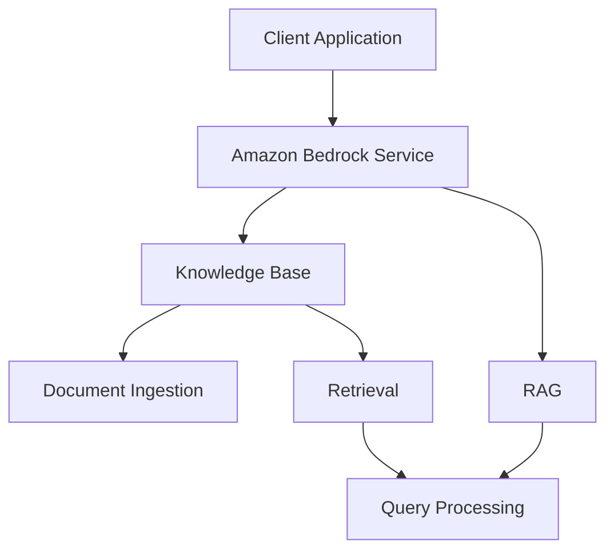

# Amazon Bedrock Workshop - 02_Knowledge_Bases_and_RAG Module Analysis

## Executive Summary

# Amazon Bedrock Workshop - Module 2 - Knowledge Bases and RAG

## Implementation Details Breakdown

### Notebooks

- **1_create-kb-and-ingest-documents.ipynb**: 1 create-kb-and-ingest-documents
- **2_managed-rag-with-retrieve-and-generate-api.ipynb**: 2 managed-rag-with-retrieve-and-generate-api
- **3_customized-rag-with-retrieve-api.ipynb**: 3 customized-rag-with-retrieve-api
- **4_clean-up.ipynb**: 4 clean-up

### Python Files

- **utility.py**: Utility

### Key Code Samples

#### From 1_create-kb-and-ingest-documents.ipynb

```python
json\n",
    "{\n",
    "    \"Version\": \"2012-10-17\",\n",
    "    \"Statement\": [\n",
    "        {\n",
    "            \"Effect\": \"Allow\",\n",
    "            \"Action\": \"aoss:*\",\n",
    "            \"Resource\": \"*\"\n",
    "        }\n",
    "    ]\n",
    "}\n",
    "
```

#### From 2_managed-rag-with-retrieve-and-generate-api.ipynb

```python
# Standard library imports
import os
import sys
import json
import time

# Third-party imports
import boto3
from botocore.client import Config
from botocore.exceptions import ClientError

# Local imports
import utility

# Print SDK versions
print(f"Python version: {sys.version.split()[0]}")
print(f"Boto3 SDK version: {boto3.__version__}")
```

#### From 3_customized-rag-with-retrieve-api.ipynb

```python
# Standard library imports
import os
import sys
import json
import time

# Third-party imports
import boto3
from botocore.client import Config
from botocore.exceptions import ClientError

# Local imports
import utility

# Print SDK versions
print(f"Python version: {sys.version.split()[0]}")
print(f"Boto3 SDK version: {boto3.__version__}")
```

## Technical Architecture Overview



## Key Takeaways and Lessons Learned

1. **Module Focus**: This module demonstrates 02 Knowledge Bases and RAG capabilities in Amazon Bedrock.

2. **Integration Patterns**: The examples show how to integrate Amazon Bedrock services into applications.

3. **Best Practices**: The code demonstrates recommended patterns for working with Amazon Bedrock APIs.

## Recommendations and Next Steps

1. **Explore Further**: Experiment with different parameters and configurations to understand their impact.

2. **Combine Capabilities**: Consider how the capabilities demonstrated in this module can be combined with other Amazon Bedrock features.

3. **Production Considerations**: When moving to production, consider aspects like error handling, monitoring, and scaling.

