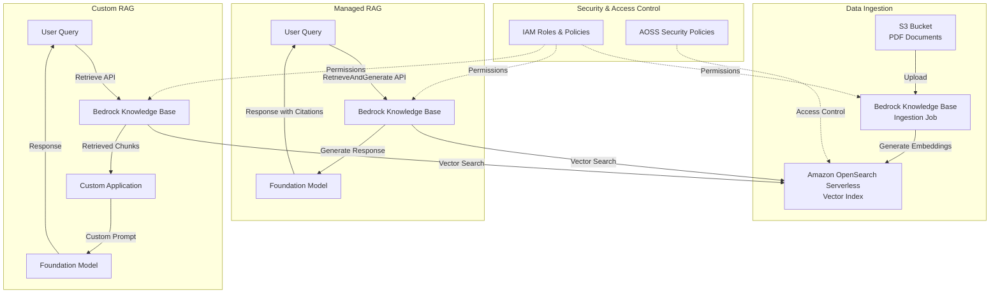
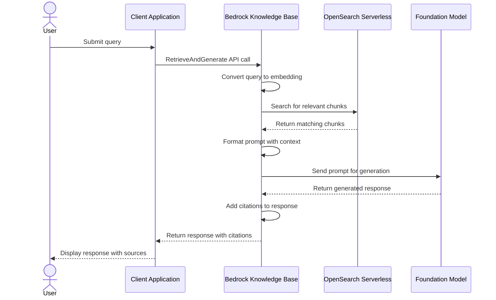
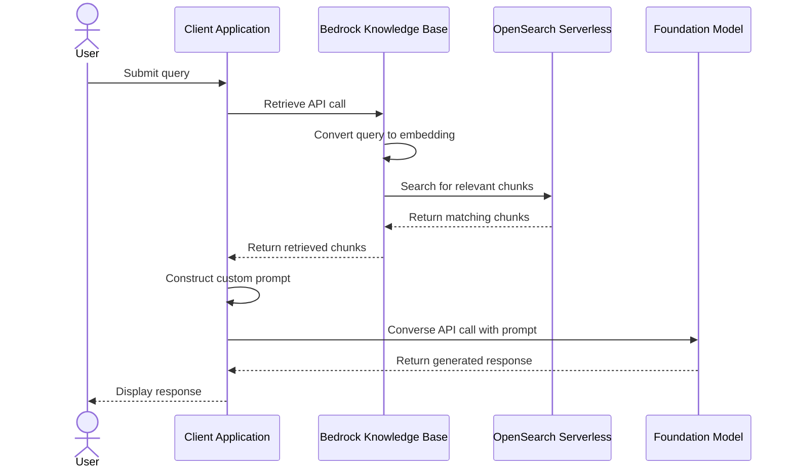

# SUMMARY-02_Knowledge_Bases_and_RAG.md

## Executive Summary

This module demonstrates how to implement Retrieval Augmented Generation (RAG) using Amazon Bedrock Knowledge Bases. The workshop guides users through creating a knowledge base, ingesting documents, and implementing two different approaches to RAG:

1. A fully-managed approach using the `RetrieveAndGenerate` API
2. A customized approach using the `Retrieve` API with manual prompt engineering

The module consists of four notebooks that progressively build a complete RAG solution, from setting up infrastructure to querying the knowledge base and finally cleaning up resources. The implementation uses Amazon S3 for document storage, Amazon OpenSearch Serverless (AOSS) for vector storage, and Amazon Bedrock foundation models for embeddings and text generation.

## Implementation Details Breakdown

### 1. Knowledge Base Creation and Document Ingestion

**Key Components:**
- **S3 Bucket**: Stores PDF documents (Amazon Shareholder Letters)
- **AOSS Collection and Index**: Vector database for storing embeddings
- **IAM Roles and Policies**: Permissions for Bedrock to access S3 and AOSS
- **Bedrock Knowledge Base**: Configuration connecting the vector store to the embedding model

**Process Flow:**
1. Create an S3 bucket and upload PDF documents
2. Set up IAM roles with necessary permissions
3. Create AOSS collection with appropriate security policies
4. Configure a vector index in AOSS with FAISS as the vector search engine
5. Create a Bedrock Knowledge Base pointing to the AOSS vector store
6. Configure data source to point to S3 bucket
7. Start ingestion job to process documents and generate embeddings

```python
# Example of creating the vector index in AOSS
index_definition = {
   "settings": {
      "index.knn": "true",
       "number_of_shards": 1,
       "knn.algo_param.ef_search": 512,
       "number_of_replicas": 0,
   },
   "mappings": {
      "properties": {
         "vector": {
            "type": "knn_vector",
            "dimension": embedding_model_dim,
             "method": {
                 "name": "hnsw",
                 "engine": "faiss",
                 "space_type": "l2"
             },
         },
         "text": {
            "type": "text"
         },
         "text-metadata": {
            "type": "text"
         }
      }
   }
}
```

### 2. Managed RAG with RetrieveAndGenerate API

**Key Components:**
- **RetrieveAndGenerate API**: Single API call that handles both retrieval and response generation
- **Citations**: Source attribution for retrieved content

**Process Flow:**
1. User submits a query
2. API automatically:
   - Converts query to vector embeddings
   - Searches the knowledge base
   - Retrieves relevant document chunks
   - Injects them into the foundation model's prompt
   - Generates a response with citations

```python
response = bedrock_agent_client.retrieve_and_generate(
    input={
        'text': user_query
    },
    retrieveAndGenerateConfiguration={
        'type': 'KNOWLEDGE_BASE',
        'knowledgeBaseConfiguration': {
            'knowledgeBaseId': bedrock_kb_id,
            'modelArn': model_arn
        }
    }
)
```

### 3. Customized RAG with Retrieve API

**Key Components:**
- **Retrieve API**: Fetches relevant document chunks without generating a response
- **Custom Prompt Engineering**: Manual construction of prompts with retrieved context
- **Converse API**: Sends the augmented prompt to a foundation model

**Process Flow:**
1. User submits a query
2. Retrieve API fetches relevant document chunks
3. Application constructs a custom prompt with:
   - System instructions
   - Retrieved context
   - User query
4. Converse API sends the prompt to a foundation model
5. Model generates a response based on the provided context

```python
# Custom RAG implementation
def retrieve(user_query, kb_id, num_of_results=5):
    return bedrock_agent_client.retrieve(
        retrievalQuery= {
            'text': user_query
        },
        knowledgeBaseId=kb_id,
        retrievalConfiguration= {
            'vectorSearchConfiguration': {
                'numberOfResults': num_of_results,
                'overrideSearchType': "HYBRID", # optional
            }
        }
    )

# Extract contexts from retrieved results
contexts = [rr['content']['text'] for rr in response['retrievalResults']]

# Generate response with custom prompt
converse_request = {
    "system": [
        {"text": system_prompt}
    ],
    "messages": [
        {
            "role": "user",
            "content": [
                {
                    "text": user_prompt_template.format(contexts=contexts, user_query=user_query)
                }
            ]
        }
    ],
    "inferenceConfig": {
        "temperature": 0.4,
        "topP": 0.9,
        "maxTokens": 500
    }
}
```

### 4. Resource Cleanup

The final notebook provides a comprehensive cleanup process to remove all created resources:
- Delete Bedrock Knowledge Base data sources
- Delete Bedrock Knowledge Base
- Delete AOSS collection and policies
- Delete IAM roles and policies
- Delete S3 objects and bucket

## Key Takeaways and Lessons Learned

1. **Two RAG Implementation Approaches**:
   - **Managed RAG** (RetrieveAndGenerate API): Simple, fully-managed solution with minimal code
   - **Custom RAG** (Retrieve API): More flexible, allows custom prompt engineering and workflow control

2. **Vector Search Options**:
   - **HYBRID**: Combines semantic search with keyword search
   - **SEMANTIC**: Pure embedding-based search for natural language content

3. **Chunking Strategy Importance**:
   - Document chunking configuration affects retrieval quality
   - The module uses fixed-size chunking with overlap:
     ```python
     "chunkingConfiguration": {
         "chunkingStrategy": "FIXED_SIZE",
         "fixedSizeChunkingConfiguration": {
             "maxTokens": 512,
             "overlapPercentage": 20
         }
     }
     ```

4. **Citation and Source Attribution**:
   - RetrieveAndGenerate API automatically provides citations
   - Helps verify response accuracy and build trust

5. **Infrastructure as Code**:
   - The module demonstrates how to programmatically create and manage all necessary AWS resources

## Technical Architecture Overview



## Request/Response Sequence Diagrams

The following sequence diagrams illustrate the step-by-step API interactions for both RAG approaches:

### Managed RAG Sequence (RetrieveAndGenerate API)



### Custom RAG Sequence (Retrieve + Converse APIs)



## Recommendations and Next Steps

1. **Production Deployment Considerations**:
   - Use VPC endpoints for private connections to OpenSearch Serverless instead of public internet access
   - Implement more granular IAM permissions based on the principle of least privilege
   - Consider implementing monitoring and logging for knowledge base usage

2. **Performance Optimization**:
   - Experiment with different chunking strategies to find the optimal balance for your content
   - Test different vector search configurations (HYBRID vs. SEMANTIC) based on your use case
   - Adjust the number of retrieved results based on the complexity of queries

3. **Enhanced RAG Implementations**:
   - Implement multi-step RAG with query reformulation
   - Add query classification to route different types of questions to specialized prompts
   - Incorporate feedback loops to improve retrieval quality over time

4. **Additional Data Sources**:
   - Extend the implementation to use other supported data sources:
     - Confluence
     - Microsoft SharePoint
     - Salesforce
     - Web Crawler
     - Custom data sources

5. **User Experience Improvements**:
   - Add a simple web interface for interacting with the knowledge base
   - Implement streaming responses for better user experience
   - Add feedback mechanisms to rate response quality

By following this module, users gain a comprehensive understanding of how to implement RAG solutions using Amazon Bedrock Knowledge Bases, from infrastructure setup to query processing, with both managed and customized approaches.

## Token Utilization Summary

- **Prompt Length**: 56098 characters
- **Estimated Token Count**: ~14024 tokens
- **Context Window Utilization**: ~7.0% of 200K token context window


---

*This summary was generated by Claude 3.7 Sonnet from Anthropic on 2025-07-06 at 17:31:54.*
