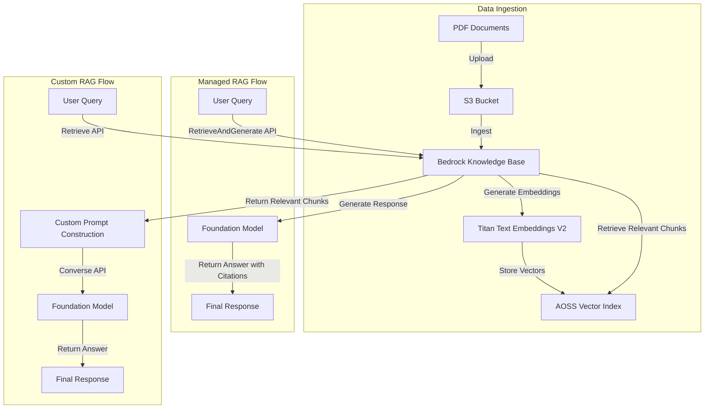
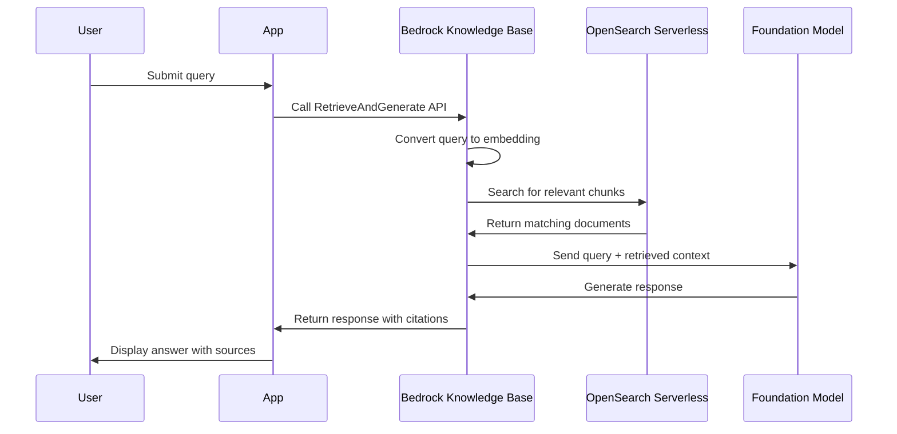
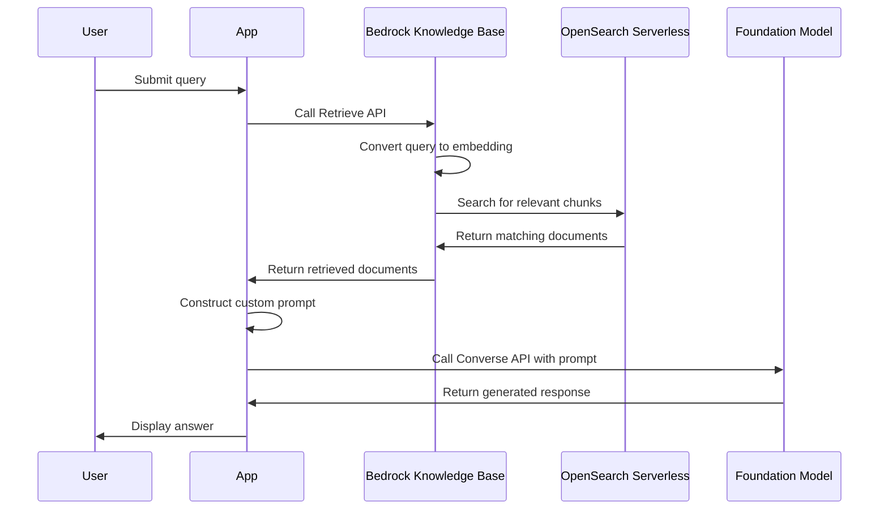

# SUMMARY-02_Knowledge_Bases_and_RAG.md

## Executive Summary

This module demonstrates how to implement Retrieval Augmented Generation (RAG) using Amazon Bedrock Knowledge Bases. The workshop guides users through creating a knowledge base, ingesting documents, and implementing two different RAG approaches:

1. **Fully-managed RAG** using the `RetrieveAndGenerate` API
2. **Custom RAG implementation** using the `Retrieve` API with manual prompt engineering

The module consists of four notebooks that progressively build a complete RAG solution using Amazon Shareholder Letters as the knowledge source. The implementation leverages Amazon OpenSearch Serverless (AOSS) as the vector store and Amazon Bedrock foundation models for embeddings and text generation.

## Implementation Details Breakdown

### 1. Knowledge Base Creation and Document Ingestion

The first notebook (`1_create-kb-and-ingest-documents.ipynb`) establishes the foundation for the RAG system:

1. **Data Source Setup**:
   - Creates an S3 bucket
   - Downloads Amazon Shareholder Letters (PDFs)
   - Uploads documents to the S3 bucket

2. **Vector Store Configuration**:
   - Creates an Amazon OpenSearch Serverless (AOSS) collection
   - Configures encryption, network, and data access policies
   - Creates a vector index with FAISS as the search engine

3. **Knowledge Base Configuration**:
   - Creates an IAM role with necessary permissions
   - Configures a Bedrock Knowledge Base using the Titan Text Embeddings V2 model
   - Connects the Knowledge Base to the S3 data source
   - Initiates document ingestion to generate vector embeddings

```python
# Vector Storage Configuration
storage_config = {
    "type": "OPENSEARCH_SERVERLESS",
    "opensearchServerlessConfiguration": {
        "collectionArn": aoss_collection["createCollectionDetail"]['arn'],
        "vectorIndexName": aoss_index_name,
        "fieldMapping": {
            "vectorField": "vector",
            "textField": "text",
            "metadataField": "text-metadata"
        }
    }
}

# Knowledge Base Configuration
knowledge_base_config = {
    "type": "VECTOR",
    "vectorKnowledgeBaseConfiguration": {
        "embeddingModelArn": embedding_model_arn
    }
}
```

### 2. Managed RAG with RetrieveAndGenerate API

The second notebook (`2_managed-rag-with-retrieve-and-generate-api.ipynb`) demonstrates the fully-managed RAG approach:

1. **RetrieveAndGenerate API**:
   - Sends a user query to the Knowledge Base
   - Automatically retrieves relevant document chunks
   - Generates a response using the specified foundation model
   - Returns both the answer and citations to source documents

```python
response = bedrock_agent_client.retrieve_and_generate(
    input={
        'text': user_query
    },
    retrieveAndGenerateConfiguration={
        'type': 'KNOWLEDGE_BASE',
        'knowledgeBaseConfiguration': {
            'knowledgeBaseId': bedrock_kb_id,
            'modelArn': model_arn
        }
    }
)
```

### 3. Custom RAG with Retrieve API

The third notebook (`3_customized-rag-with-retrieve-api.ipynb`) demonstrates a more flexible RAG approach:

1. **Retrieve API**:
   - Retrieves relevant document chunks based on the user query
   - Supports both semantic and hybrid search strategies

2. **Custom Prompt Engineering**:
   - Constructs a system prompt for the foundation model
   - Creates a user prompt that incorporates retrieved context
   - Sends the augmented prompt to the model via the Converse API

```python
# Retrieve relevant documents
response = retrieve(user_query, bedrock_kb_id, num_of_results=3)

# Extract context from retrieved documents
contexts = [rr['content']['text'] for rr in response['retrievalResults']]

# Generate response using Converse API with custom prompt
response = bedrock_client.converse(
    modelId=model_id,
    system=converse_request['system'],
    messages=converse_request["messages"],
    inferenceConfig=converse_request["inferenceConfig"]
)
```

### 4. Resource Cleanup

The final notebook (`4_clean-up.ipynb`) provides instructions for removing all created resources:

1. Deletes the Bedrock Knowledge Base data sources
2. Deletes the Bedrock Knowledge Base
3. Deletes the AOSS collection and policies
4. Removes IAM roles and policies
5. Empties and deletes the S3 bucket

## Key Takeaways and Lessons Learned

1. **RAG Implementation Options**:
   - **Fully-managed approach**: The `RetrieveAndGenerate` API provides a simple, end-to-end solution with minimal code.
   - **Custom approach**: The `Retrieve` API offers more flexibility for tailored RAG implementations.

2. **Vector Store Integration**:
   - Amazon Bedrock Knowledge Bases seamlessly integrates with AOSS for vector storage.
   - The implementation handles vector embedding generation and storage automatically.

3. **Search Strategies**:
   - **Hybrid search**: Combines semantic (vector) and keyword search for improved accuracy.
   - **Semantic search**: Uses pure vector similarity for natural language understanding.

4. **Citation and Source Attribution**:
   - The RAG implementation provides source attribution for generated responses.
   - Citations include document metadata like source URI and page numbers.

5. **Chunking Strategy**:
   - Documents are automatically chunked during ingestion based on configured parameters.
   - The chunking strategy affects retrieval quality and context window utilization.

## Technical Architecture Overview



### Sequence Diagram for RetrieveAndGenerate API



### Sequence Diagram for Retrieve API with Custom Prompt



## Recommendations and Next Steps

1. **Production Deployment Considerations**:
   - Use VPC endpoints for private connections to AOSS instead of public internet access
   - Implement proper error handling and retry mechanisms
   - Consider monitoring and logging for tracking usage and performance

2. **RAG Optimization Opportunities**:
   - Experiment with different chunking strategies to improve retrieval quality
   - Test different search types (hybrid vs. semantic) based on content type
   - Adjust the number of retrieved results based on application needs

3. **Advanced RAG Techniques**:
   - Implement re-ranking of retrieved documents for better relevance
   - Add metadata filtering to narrow down search results
   - Explore multi-modal RAG by incorporating image embeddings

4. **Integration Possibilities**:
   - Connect to other data sources like Confluence, SharePoint, or Salesforce
   - Integrate with conversational interfaces for multi-turn dialogues
   - Combine with Amazon Bedrock Agents for more complex workflows

5. **Performance Optimization**:
   - Adjust vector dimensions and index parameters for better search performance
   - Implement caching for frequently asked questions
   - Consider batch processing for large document collections

By following this module, users gain practical experience with Amazon Bedrock Knowledge Bases and learn how to implement both managed and custom RAG solutions. The workshop provides a solid foundation for building more complex RAG applications with Amazon Bedrock.

## Token Utilization Summary

- **Prompt Length**: 56362 characters
- **Estimated Token Count**: ~14090 tokens
- **Context Window Utilization**: ~7.0% of 200K token context window


---

*This summary was generated by Claude 3.7 Sonnet from Anthropic on 2025-07-06 at 17:42:55.*