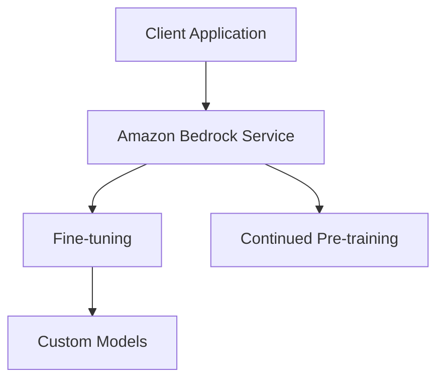

# Amazon Bedrock Workshop - 03_Model_customization Module Analysis

## Executive Summary

# Lab 10 - Custom Models 

## Implementation Details Breakdown

### Notebooks

- **01_fine-tune_Amazon_Nova.ipynb**: 01 fine-tune amazon nova
- **02_Inference_Amazon_Nova.ipynb**: 02 inference amazon nova
- **01_setup.ipynb**: 01 setup
- **02_fine-tune_Claude_Haiku.ipynb**: 02 fine-tune claude haiku
- **01_setup_llama-3.2.ipynb**: 01 setup llama-3.2
- **02_fine-tune_llama3.2.ipynb**: 02 fine-tune llama3.2
- **01_setup.ipynb**: 01 setup
- **02_continued_pretraining_titan_text.ipynb**: 02 continued pretraining titan text
- **03_cleanup.ipynb**: 03 cleanup

### Key Code Samples

#### From 01_fine-tune_Amazon_Nova.ipynb

```python
\\n\n",
    "for model in bedrock.list_foundation_models(\n",
    "    byCustomizationType=\"FINE_TUNING\")[\"modelSummaries\"]:\n",
    "    for key, value in model.items():\n",
    "        print(key, \":\", value)\n",
    "    print(\"-----\\n\")\n",
    "
```

#### From 02_Inference_Amazon_Nova.ipynb

```python
!pip install -qU -r requirements.txt
```

#### From 01_setup.ipynb

```python
!pip install --upgrade pip
%pip install --no-build-isolation --force-reinstall \
    "boto3>=1.28.57" \
    "awscli>=1.29.57" \
    "botocore>=1.31.57"
!pip install -qU --force-reinstall langchain typing_extensions pypdf urllib3==2.1.0
!pip install -qU ipywidgets>=7,<8
!pip install jsonlines
!pip install datasets==2.15.0
!pip install pandas==2.1.3
!pip install matplotlib==3.8.2
```

## Technical Architecture Overview



## Key Takeaways and Lessons Learned

1. **Module Focus**: This module demonstrates 03 Model customization capabilities in Amazon Bedrock.

2. **Integration Patterns**: The examples show how to integrate Amazon Bedrock services into applications.

3. **Best Practices**: The code demonstrates recommended patterns for working with Amazon Bedrock APIs.

## Recommendations and Next Steps

1. **Explore Further**: Experiment with different parameters and configurations to understand their impact.

2. **Combine Capabilities**: Consider how the capabilities demonstrated in this module can be combined with other Amazon Bedrock features.

3. **Production Considerations**: When moving to production, consider aspects like error handling, monitoring, and scaling.

