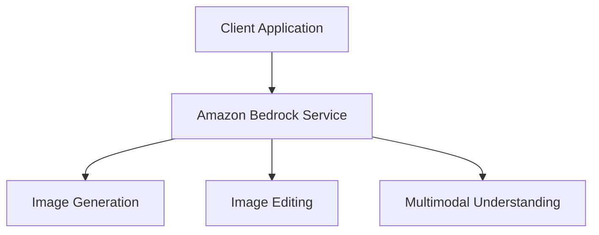

# Amazon Bedrock Workshop - 04_Image_and_Multimodal Module Analysis

## Executive Summary

# Module 4 - Image Generation and Multimodal Embeddings

## Implementation Details Breakdown

### Notebooks

- **1_titan-multimodal-embeddings-lab.ipynb**: 1 titan-multimodal-embeddings-lab
- **2_nova-canvas-lab.ipynb**: 2 nova-canvas-lab
- **3_nova-reel-lab.ipynb**: 3 nova-reel-lab

### Key Code Samples

#### From 1_titan-multimodal-embeddings-lab.ipynb

```python
\n",
    "Generate a list of 7 items description for an online e-commerce shop, each comes with 3 variants of color or type. All with separate full sentence description.\n",
    "
```

#### From 2_nova-canvas-lab.ipynb

```python
# Built-in libraries
import base64
import io
import json
import os
import sys

# External dependencies
import boto3
import botocore
import numpy as np
import matplotlib.pyplot as plt

from PIL import Image

# Set up Bedrock client
boto3_bedrock = boto3.client('bedrock-runtime')
```

#### From 3_nova-reel-lab.ipynb

```python
import os
import time
import boto3
import json
import base64
from botocore.exceptions import ClientError

account_id = boto3.client('sts').get_caller_identity().get('Account')

bedrock_runtime = boto3.client('bedrock-runtime')
s3_bucket = f"video-bucket-{account_id}"
local_output_folder = "output"
```

## Technical Architecture Overview



## Key Takeaways and Lessons Learned

1. **Module Focus**: This module demonstrates 04 Image and Multimodal capabilities in Amazon Bedrock.

2. **Integration Patterns**: The examples show how to integrate Amazon Bedrock services into applications.

3. **Best Practices**: The code demonstrates recommended patterns for working with Amazon Bedrock APIs.

## Recommendations and Next Steps

1. **Explore Further**: Experiment with different parameters and configurations to understand their impact.

2. **Combine Capabilities**: Consider how the capabilities demonstrated in this module can be combined with other Amazon Bedrock features.

3. **Production Considerations**: When moving to production, consider aspects like error handling, monitoring, and scaling.

