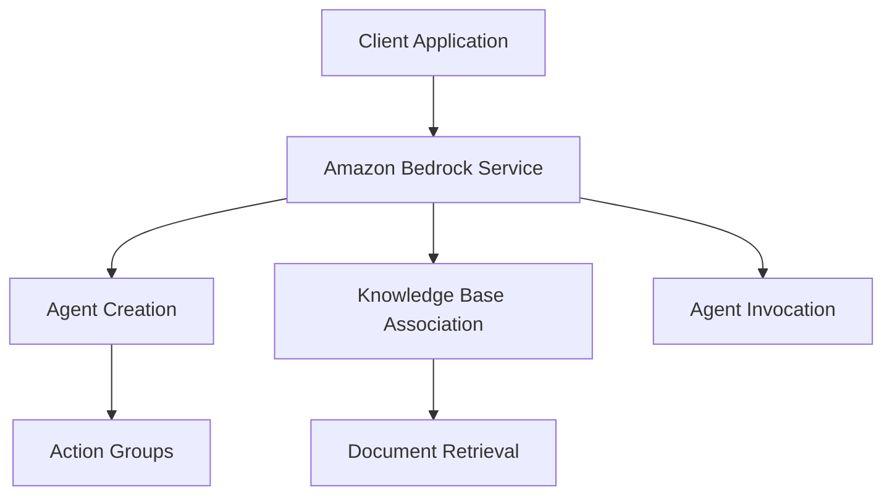

# Amazon Bedrock Workshop - 05_Agents Module Analysis

## Executive Summary

# Lab 7 - Agents for Bedrock

## Implementation Details Breakdown

### Notebooks

- **01_create_agent.ipynb**: 01 create agent
- **02_associate_knowledge_base_to_agent.ipynb**: 02 associate knowledge base to agent
- **03_invoke_agent.ipynb**: 03 invoke agent
- **04_clean_up_agent_resources.ipynb**: 04 clean up agent resources
- **05_bonus_inline_agents.ipynb**: 05 bonus inline agents

### Python Files

- **agent.py**: Agent
- **knowledge_base.py**: Knowledge base

### Key Code Samples

#### From 01_create_agent.ipynb

```python
get_booking_details(booking_id)
```

#### From 02_associate_knowledge_base_to_agent.ipynb

```python
%store -r
```

#### From 03_invoke_agent.ipynb

```python
%store -r
```

## Technical Architecture Overview



## Key Takeaways and Lessons Learned

1. **Module Focus**: This module demonstrates 05 Agents capabilities in Amazon Bedrock.

2. **Integration Patterns**: The examples show how to integrate Amazon Bedrock services into applications.

3. **Best Practices**: The code demonstrates recommended patterns for working with Amazon Bedrock APIs.

## Recommendations and Next Steps

1. **Explore Further**: Experiment with different parameters and configurations to understand their impact.

2. **Combine Capabilities**: Consider how the capabilities demonstrated in this module can be combined with other Amazon Bedrock features.

3. **Production Considerations**: When moving to production, consider aspects like error handling, monitoring, and scaling.

