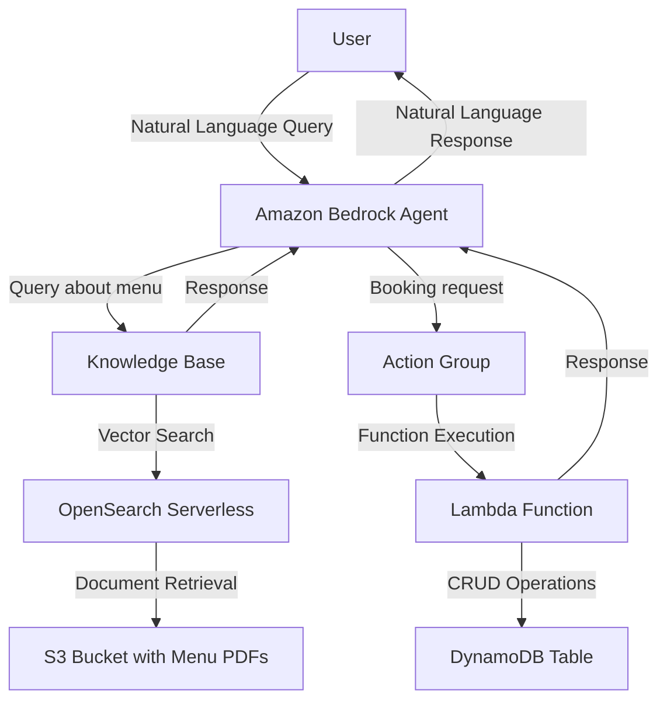
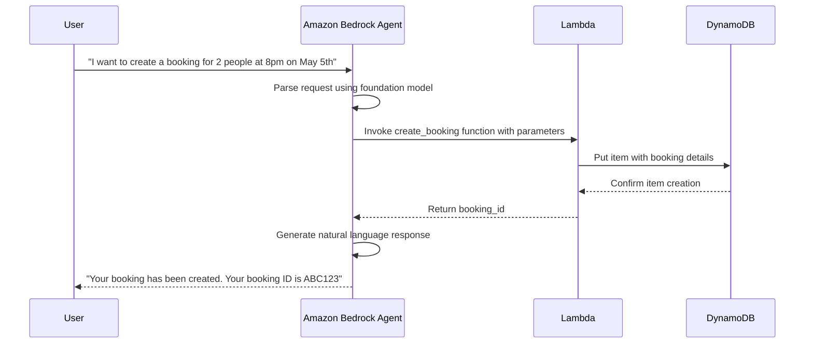
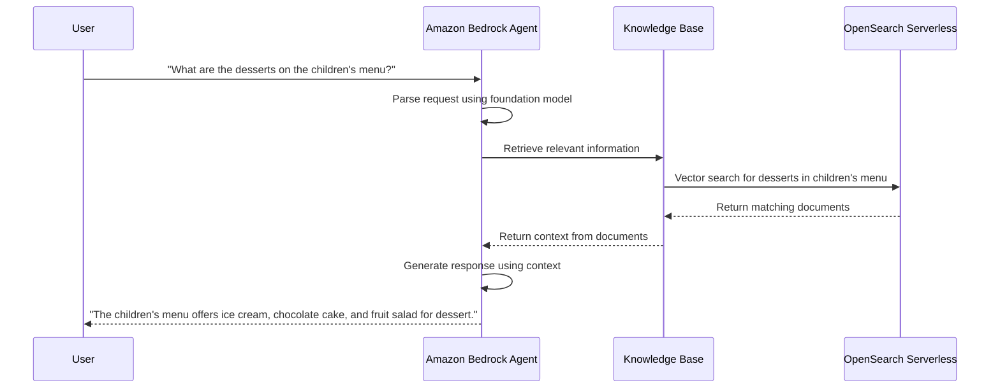

# SUMMARY-05_Agents.md

## Executive Summary

This module introduces Amazon Bedrock Agents, a capability that allows developers to create AI assistants that can perform multi-step business tasks using natural language. The workshop demonstrates how to build a restaurant assistant agent that can handle table bookings and answer questions about the restaurant's menu. The implementation showcases key agent components including foundation models, instructions, action groups, and knowledge bases.

The module consists of four main notebooks that guide users through:
1. Creating an agent with action groups using Boto3
2. Integrating a knowledge base with the agent
3. Testing the agent with various invocation patterns
4. Cleaning up resources

The implementation demonstrates a practical use case where customers can interact with a restaurant assistant to create, retrieve, or delete table bookings, as well as ask questions about the restaurant's menu offerings.

## Implementation Details Breakdown

### Agent Creation and Configuration

The implementation begins by setting up the foundation for the agent:

1. **Agent Definition**: The agent is configured with a name, description, and instructions that define its purpose and behavior.

```python
agent_name = 'booking-agent'
agent_description = "Agent in charge of a restaurants table bookings"
agent_instruction = """
You are a restaurant agent, helping clients retrieve information from their booking,
create a new booking or delete an existing booking
"""
```

2. **Foundation Model Selection**: The agent uses Claude 3 Sonnet or Claude 3 Haiku as its underlying foundation model.

3. **DynamoDB Table Creation**: A DynamoDB table is created to store booking information with attributes like `booking_id`, `date`, `name`, `hour`, and `num_guests`.

4. **Lambda Function Implementation**: A Lambda function is created to handle three main actions:
   - `get_booking_details`: Retrieves booking information based on a booking ID
   - `create_booking`: Creates a new booking with customer details
   - `delete_booking`: Removes an existing booking

5. **IAM Roles and Permissions**: The implementation creates necessary IAM roles and policies for the agent and Lambda function to interact with AWS services.

6. **Action Group Definition**: An action group is defined with function schemas that specify the available actions, their parameters, and descriptions.

```python
agent_functions = [
    {
        'name': 'get_booking_details',
        'description': 'Retrieve details of a restaurant booking',
        'parameters': {
            "booking_id": {
                "description": "The ID of the booking to retrieve",
                "required": True,
                "type": "string"
            }
        }
    },
    # Additional functions defined...
]
```

### Knowledge Base Integration

The second notebook demonstrates how to enhance the agent with a knowledge base:

1. **Knowledge Base Creation**: A knowledge base is created with OpenSearch Serverless as the vector database.

2. **Document Ingestion**: Restaurant menu PDFs are uploaded to S3 and ingested into the knowledge base.

3. **Vector Index Creation**: A vector index is created in OpenSearch to enable semantic search.

4. **Agent Role Update**: The agent's IAM role is updated to allow it to query the knowledge base.

5. **Knowledge Base Association**: The knowledge base is associated with the agent to provide context about the restaurant's menus.

### Agent Testing

The third notebook demonstrates various ways to interact with the agent:

1. **Basic Invocation**: Testing simple queries about the restaurant menu.

2. **Session Management**: Demonstrating how to maintain context across multiple interactions.

3. **Action Group Execution**: Testing the booking functionality by creating, retrieving, and deleting reservations.

4. **Prompt Attributes**: Using session attributes to provide additional context to the agent.

5. **Multilingual Support**: Testing the agent's ability to handle queries in different languages.

6. **Trace Functionality**: Using the trace feature to understand the agent's reasoning process.

### Resource Cleanup

The final notebook provides a systematic approach to clean up all created resources:

1. Disassociating the knowledge base from the agent
2. Deleting the agent, action groups, and aliases
3. Deleting the Lambda function
4. Deleting the DynamoDB table
5. Deleting the knowledge base and its components
6. Removing IAM roles and policies

## Key Takeaways and Lessons Learned

1. **Orchestration Capabilities**: Agents for Amazon Bedrock can orchestrate complex workflows by breaking down user requests into logical steps and executing them in sequence.

2. **Context Awareness**: The agent maintains conversation context across multiple interactions, allowing for natural follow-up questions and references to previous statements.

3. **Integration Flexibility**: Agents can be integrated with various AWS services like DynamoDB, Lambda, and OpenSearch Serverless to create comprehensive solutions.

4. **Knowledge Enhancement**: Adding a knowledge base significantly improves the agent's ability to provide accurate and relevant information beyond its base instructions.

5. **Multilingual Support**: Foundation models like Claude can handle queries in multiple languages without requiring explicit configuration.

6. **Session Management**: The session state allows for maintaining context and providing additional information to the agent during invocation.

7. **Tracing for Debugging**: The trace functionality provides insights into the agent's reasoning process, making it easier to debug and understand its behavior.

8. **Prompt Engineering**: The quality of instructions and action descriptions significantly impacts the agent's performance and accuracy.

## Technical Architecture Overview



### Sequence Diagram for Booking Creation



### Sequence Diagram for Menu Query



## Recommendations and Next Steps

1. **Advanced Prompt Engineering**: Experiment with different instructions and prompt formats to improve the agent's understanding and response quality.

2. **Guardrails Implementation**: Add guardrails to ensure the agent adheres to responsible AI principles and handles edge cases appropriately.

3. **Return of Control**: Implement return of control patterns for scenarios where the agent needs to delegate decision-making back to the application.

4. **Performance Optimization**: Monitor token usage and response times to optimize the agent's performance and cost-effectiveness.

5. **Error Handling**: Enhance error handling for edge cases like invalid booking dates or unavailable time slots.

6. **Integration with Other Services**: Extend the agent's capabilities by integrating with additional services like Amazon Connect for voice interactions or Amazon Pinpoint for notifications.

7. **Advanced Knowledge Base Features**: Explore more sophisticated knowledge base configurations, such as multiple data sources or hybrid retrieval strategies.

8. **User Experience Enhancements**: Implement features like proactive suggestions or personalized recommendations based on user preferences.

9. **Monitoring and Analytics**: Set up monitoring and analytics to track agent usage patterns and identify areas for improvement.

10. **Inline Agents**: Explore the use of inline agents for more dynamic and flexible agent configurations, as demonstrated in the bonus notebook.

## Token Utilization Summary

- **Prompt Length**: 120604 characters
- **Estimated Token Count**: ~30151 tokens
- **Context Window Utilization**: ~15.1% of 200K token context window


---

*This summary was generated by Claude 3.7 Sonnet from Anthropic on 2025-07-06 at 17:45:39.*