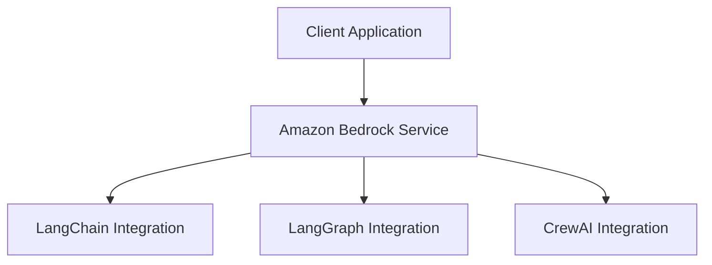

# Amazon Bedrock Workshop - 06_OpenSource_examples Module Analysis

## Executive Summary

# Open-Source Module: Amazon Bedrock Integration with LangChain and Agentic Frameworks

## Implementation Details Breakdown

### Notebooks

- **advance-langgraph-multi-agent-setup.ipynb**: Advance-langgraph-multi-agent-setup
- **find-relevant-information-using-RAG.ipynb**: Find-relevant-information-using-rag
- **intermediate-langgraph-agent-setup-w-tools.ipynb**: Intermediate-langgraph-agent-setup-w-tools
- **ragas-agent-evaluation.ipynb**: Ragas-agent-evaluation
- **simple-crewai-agent-setup.ipynb**: Simple-crewai-agent-setup
- **simple-langgraph-agent-setup.ipynb**: Simple-langgraph-agent-setup
- **00_simple_chatbot.ipynb**: 00 simple chatbot
- **01_zero_shot_generation.ipynb**: 01 zero shot generation
- **02_code_interpret_w_langchain.ipynb**: 02 code interpret w langchain
- **03_code_translate_w_langchain.ipynb**: 03 code translate w langchain
- **04_long_text_summarization_using_LCEL_chains_on_langchain.ipynb**: 04 long text summarization using lcel chains on langchain

### Python Files

- **utils.py**: Utils

### Key Code Samples

#### From advance-langgraph-multi-agent-setup.ipynb

```python
from langchain_core.tools import tool
import random
from datetime import datetime, timedelta
import pandas as pd
from langchain_core.runnables.config import RunnableConfig
import sqlite3
from contextlib import closing


def read_travel_data(file_path: str = "data/synthetic_travel_data.csv") -> pd.DataFrame:
    """Read travel data from CSV file"""
    try:
        df = pd.read_csv(file_path)
        return df
    except FileNotFoundError:
        return pd.DataFrame(
            columns=["Id", "...
```

#### From find-relevant-information-using-RAG.ipynb

```python
import boto3
import faiss
import re
from operator import itemgetter
from typing import List
from langchain_aws.chat_models.bedrock import ChatBedrock
from langchain_aws import BedrockEmbeddings
from langchain_core.prompts import (
    ChatPromptTemplate,
    FewShotChatMessagePromptTemplate,
)
from IPython.display import display_markdown, Markdown
from langchain_community.docstore import InMemoryDocstore
from langchain_community.vectorstores import FAISS
from pydantic import BaseModel, Field
fro...
```

#### From intermediate-langgraph-agent-setup-w-tools.ipynb

```python
StateGraph
```

## Technical Architecture Overview



## Key Takeaways and Lessons Learned

1. **Module Focus**: This module demonstrates 06 OpenSource examples capabilities in Amazon Bedrock.

2. **Integration Patterns**: The examples show how to integrate Amazon Bedrock services into applications.

3. **Best Practices**: The code demonstrates recommended patterns for working with Amazon Bedrock APIs.

## Recommendations and Next Steps

1. **Explore Further**: Experiment with different parameters and configurations to understand their impact.

2. **Combine Capabilities**: Consider how the capabilities demonstrated in this module can be combined with other Amazon Bedrock features.

3. **Production Considerations**: When moving to production, consider aspects like error handling, monitoring, and scaling.

