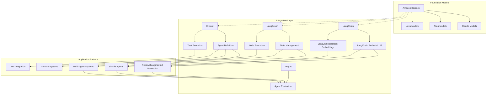

# Amazon Bedrock Integration with Open-Source Frameworks - Technical Summary

## Executive Summary

The `06_OpenSource_examples` module demonstrates how to integrate Amazon Bedrock's foundation models with popular open-source frameworks for building generative AI applications. The module showcases various implementation patterns ranging from simple text generation with LangChain to complex multi-agent systems using LangGraph and CrewAI. These examples highlight how developers can leverage Amazon Bedrock's powerful foundation models while using familiar open-source tools to build sophisticated AI applications with features like retrieval-augmented generation (RAG), agent-based workflows, and evaluation frameworks.

## Technical Architecture Overview



## Implementation Details Breakdown

### 1. LangChain Integration with Amazon Bedrock

The module demonstrates several ways to use LangChain with Amazon Bedrock for text generation tasks:

#### Simple Chatbot Implementation

```python
from langchain_aws import ChatBedrockConverse
import boto3

bedrock_client = boto3.client("bedrock-runtime", region_name="us-west-2")
llm = ChatBedrockConverse(
    model="anthropic.claude-3-haiku-20240307-v1:0",
    temperature=0,
    max_tokens=None,
    client=bedrock_client,
)
```

Key features demonstrated:
- Creating a chatbot with conversation memory
- Using prompt templates for consistent interactions
- Multi-language support through foundation models

#### Code Interpretation and Translation

The notebooks show how to use Bedrock models for code-related tasks:
- Interpreting and explaining code snippets
- Translating code between programming languages
- Generating code based on natural language descriptions

#### Long Text Summarization with LCEL

```python
from langchain_core.runnables import RunnablePassthrough, RunnableParallel

# Example of LCEL (LangChain Expression Language) chain for summarization
summarization_chain = (
    RunnableParallel(
        {"text": RunnablePassthrough(), "prompt": lambda x: summarization_prompt}
    )
    | bedrock_llm
    | StrOutputParser()
)
```

This pattern demonstrates:
- Breaking down long documents into manageable chunks
- Processing chunks in parallel for efficiency
- Combining results into a coherent summary

### 2. Retrieval-Augmented Generation (RAG) Implementation

The `find-relevant-information-using-RAG.ipynb` notebook provides a comprehensive implementation of RAG with several advanced techniques:

#### Query Processing Pipeline

```python
rag_chain = RunnableParallel(
    question=RunnablePassthrough(),
    intent=few_shot_intent_detection_prompt | nova | parse_intent
) | RunnableBranch(
    (lambda payload: "vacation" == payload["intent"].lower(), lambda x: (
        RunnablePassthrough().pick(["question"])
        .assign(question=norm_chain)
        .assign(question=parse_norm_message)
        .assign(context=lambda inputs: wiki.invoke(inputs["question"]))
        .assign(answer=answer_generator)
        .pick(["answer", "context"])
    )),
    # Additional branches...
)
```

Key techniques demonstrated:
- **Intent Detection**: Using few-shot learning to classify user queries
- **Query Normalization**: Reformulating queries for better retrieval
- **Query Decomposition**: Breaking complex queries into simpler sub-queries
- **Hypothetical Document Embeddings (HyDE)**: Generating synthetic documents to improve retrieval

#### Document Retrieval and Answer Generation

```python
citation_chain = (
    RunnableParallel(question=RunnablePassthrough(), docs=wiki)
    .assign(context=format)
    .assign(answer=answer_generator)
    .pick(["answer", "docs"])
)
```

This implementation shows:
- Retrieving relevant documents from vector stores
- Formatting documents for model consumption
- Generating answers with proper citations
- Self-validation to improve answer quality

### 3. Agent Frameworks with LangGraph

The `simple-langgraph-agent-setup.ipynb` and `intermediate-langgraph-agent-setup-w-tools.ipynb` notebooks demonstrate how to build agents using LangGraph:

#### State Management in LangGraph

```python
class PlannerState(TypedDict):
    messages: Annotated[List[HumanMessage | AIMessage], "The messages in the conversation"]
    itinerary: str
    city: str
    user_message: str

workflow = StateGraph(PlannerState)
workflow.add_node("input_interests", input_interests)
workflow.add_node("create_itinerary", create_itinerary)
workflow.set_entry_point("input_interests")
workflow.add_edge("input_interests", "create_itinerary")
workflow.add_edge("create_itinerary", END)
```

Key concepts demonstrated:
- Defining state schemas for agent workflows
- Creating nodes for different processing steps
- Connecting nodes with edges to define workflow
- Managing conversation context across interactions

#### Memory Systems in LangGraph

```python
# In-memory store for conversation history
memory = MemorySaver()
app = workflow.compile(checkpointer=memory)

# External memory store
in_memory_store = CustomMemoryStore(InMemoryStore())
app = workflow.compile(store=in_memory_store)
```

The implementation shows:
- Short-term memory for maintaining conversation context
- Long-term memory for persistent information storage
- Session-based memory management for multi-user scenarios

### 4. CrewAI for React-Style Agents

The `simple-crewai-agent-setup.ipynb` notebook demonstrates an alternative approach to agent development using CrewAI:

```python
from crewai import Agent, Task, Crew, LLM
from crewai.tools import tool

# Define the Agent
travel_agent = Agent(
    role='Travel Destination Researcher',
    goal='Find dream destinations matching user preferences',
    backstory="You are an experienced travel agent specializing in personalized travel recommendations.",
    verbose=True,
    allow_delegation=False,
    llm=llm,
    tools=[search]
)

# Define the Task
task = Task(
    description="Based on the user's travel preferences: {preferences}, research and recommend suitable travel destinations.",
    expected_output="A list of recommended destinations with brief descriptions.",
    agent=travel_agent
)

# Create the Crew
crew = Crew(
    agents=[travel_agent],
    tasks=[task],
    verbose=True,
)
```

Key features demonstrated:
- Role-based agent definition
- Task-oriented workflow design
- Tool integration for web search capabilities
- Memory integration for context retention

### 5. Multi-Agent Systems with LangGraph

The `advance-langgraph-multi-agent-setup.ipynb` notebook demonstrates how to build complex multi-agent systems:

```python
# Example of multi-agent workflow (conceptual)
travel_planner = StateGraph()
travel_planner.add_node("destination_researcher", destination_researcher_agent)
travel_planner.add_node("itinerary_creator", itinerary_creator_agent)
travel_planner.add_node("booking_assistant", booking_assistant_agent)

travel_planner.add_edge("destination_researcher", "itinerary_creator")
travel_planner.add_edge("itinerary_creator", "booking_assistant")
travel_planner.add_conditional_edges(
    "booking_assistant",
    lambda x: "needs_modification" if x["requires_changes"] else "complete",
    {
        "needs_modification": "itinerary_creator",
        "complete": END
    }
)
```

This implementation demonstrates:
- Multiple specialized agents working together
- Complex workflow with conditional branching
- Inter-agent communication patterns
- Collaborative problem-solving

### 6. Agent Evaluation with Ragas

The `ragas-agent-evaluation.ipynb` notebook shows how to evaluate agent performance:

```python
from ragas.messages import HumanMessage as RGHumanMessage
from ragas.messages import AIMessage as RGAIMessage
from ragas.messages import ToolMessage as RGToolMessage
from ragas.messages import ToolCall as RGToolCall

def convert_message_langchain_to_ragas(lc_message):
    message_dict = lc_message.model_dump()
    if message_dict['type'] == 'human':
        rg_message = RGHumanMessage(content=message_dict['content'])
    # Additional conversion logic...
    return rg_message
```

Key evaluation aspects covered:
- Converting between message formats for evaluation
- Measuring retrieval quality
- Assessing answer faithfulness to retrieved content
- Evaluating answer relevance to user queries

## Key Takeaways and Lessons Learned

1. **Integration Flexibility**: Amazon Bedrock can be seamlessly integrated with popular open-source frameworks like LangChain, LangGraph, and CrewAI, allowing developers to leverage both AWS's managed foundation models and the flexibility of open-source tools.

2. **RAG Enhancement Techniques**: The module demonstrates several advanced techniques to improve RAG performance:
   - Query preprocessing (normalization, decomposition, expansion)
   - Hypothetical document generation
   - Self-validation and citation
   - These techniques can significantly improve retrieval quality and answer relevance.

3. **Agent Design Patterns**: Two main approaches to agent design are demonstrated:
   - **LangGraph**: Graph-based workflow approach with explicit state management
   - **CrewAI**: React-style agents with role-based definitions
   - Each approach has strengths for different use cases.

4. **Memory Management**: Effective memory systems are crucial for maintaining context in conversational applications:
   - Short-term memory for immediate context
   - Long-term memory for persistent information
   - External storage for scalable solutions

5. **Tool Integration**: Agents become more powerful when they can access external tools:
   - Web search capabilities
   - Vector stores for document retrieval
   - Custom functions for specific tasks

## Technical Recommendations and Next Steps

1. **Production Deployment Considerations**:
   - Implement proper error handling and retry mechanisms
   - Set up monitoring and logging for agent operations
   - Consider caching mechanisms for frequently accessed embeddings
   - Implement authentication and authorization for API access

2. **Performance Optimization**:
   - Use parallel processing for independent operations
   - Implement batching for multiple similar requests
   - Consider model selection based on task complexity (e.g., Nova Lite for simpler tasks, Nova Pro for complex reasoning)
   - Optimize vector store configurations for faster retrieval

3. **Advanced Agent Features**:
   - Implement more sophisticated planning capabilities
   - Add reflection mechanisms for self-improvement
   - Develop specialized agents for different domains
   - Explore hybrid approaches combining LangGraph and CrewAI patterns

4. **Integration Opportunities**:
   - Connect to additional data sources beyond web search
   - Integrate with AWS services like Lambda for serverless execution
   - Implement webhooks for real-time notifications
   - Explore multi-modal capabilities with image and audio processing

5. **Evaluation and Monitoring**:
   - Implement comprehensive evaluation frameworks
   - Set up continuous monitoring of agent performance
   - Collect user feedback for ongoing improvement
   - Develop automated testing for agent behaviors

## Conclusion

The `06_OpenSource_examples` module provides a comprehensive overview of how Amazon Bedrock can be integrated with popular open-source frameworks to build sophisticated generative AI applications. By combining the power of Amazon's foundation models with the flexibility of open-source tools, developers can create applications that leverage advanced techniques like RAG, agent-based workflows, and multi-agent systems.

The examples range from simple text generation to complex multi-agent systems, providing a valuable resource for developers at different stages of their generative AI journey. The module also highlights the importance of proper evaluation and the potential for combining different approaches to create more powerful and flexible solutions.

As the field of generative AI continues to evolve, the patterns demonstrated in this module provide a solid foundation for building applications that can adapt to new requirements and capabilities while maintaining the reliability and scalability of AWS services.
