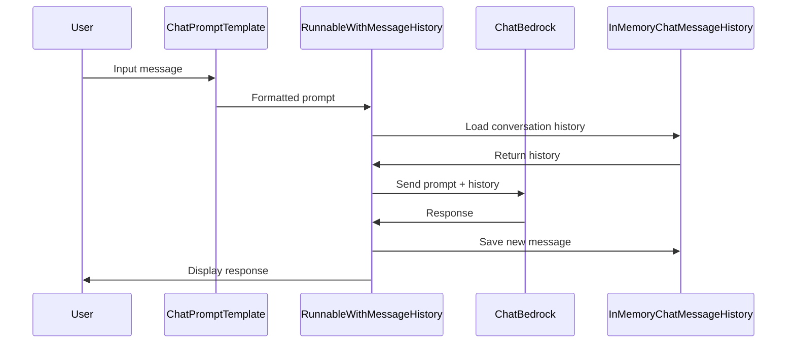
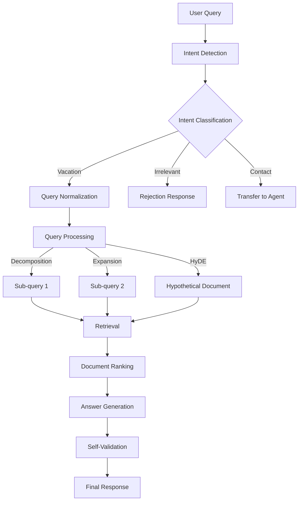
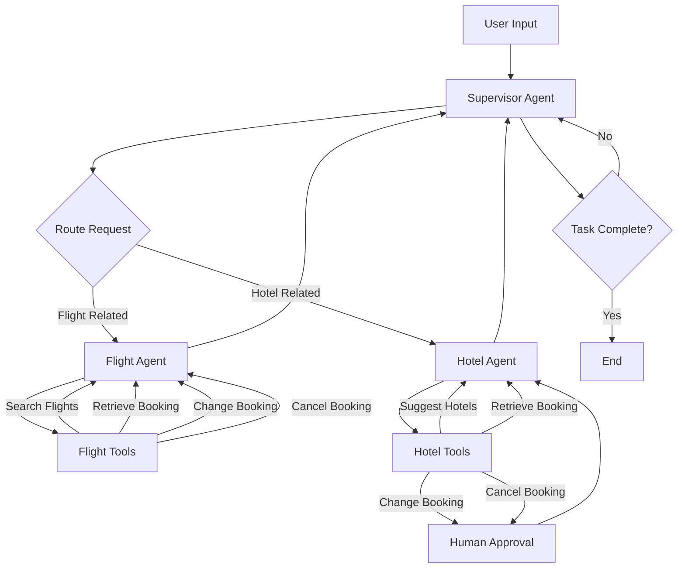

# SUMMARY-06_OpenSource_examples.md

## Executive Summary

The Amazon Bedrock Workshop Module 06 demonstrates how to integrate Amazon Bedrock with popular open-source frameworks like LangChain, LangGraph, and CrewAI. The module consists of 11 Jupyter notebooks that showcase various applications ranging from simple chatbots to complex agentic systems with retrieval-augmented generation (RAG) capabilities. The notebooks are organized into two main categories: high-level use cases (text generation with LangChain) and advanced agentic frameworks with evaluations and RAG. This module provides a comprehensive overview of how Amazon Bedrock can be leveraged with open-source tools to build sophisticated AI applications.

## Implementation Details Breakdown

### High-Level Use Cases with LangChain

1. **Simple Chatbot (00_simple_chatbot.ipynb)**
   - Implements a multi-lingual greeter chatbot using LangChain with Amazon Bedrock
   - Demonstrates conversation retention using `InMemoryChatMessageHistory`
   - Shows how to use `RunnableWithMessageHistory` to maintain conversation state
   - Implements prompt templating for multi-lingual capabilities

2. **Zero-Shot Generation (01_zero_shot_generation.ipynb)**
   - Demonstrates zero-shot text generation using Amazon Nova Lite model
   - Uses `PromptTemplate` to create customizable prompts for email generation
   - Shows how to respond to customer feedback in a customer service scenario

3. **Code Interpretation (02_code_interpret_w_langchain.ipynb)**
   - Explains and interprets code snippets using LLMs
   - Uses a custom prompt template to provide context for code explanation
   - Demonstrates how to identify red flags and best practices in code

4. **Code Translation (03_code_translate_w_langchain.ipynb)**
   - Translates code from one programming language to another (C++ to Java)
   - Uses a custom prompt template to guide the translation process
   - Shows how to maintain functionality while adapting to language-specific constructs

5. **Long Text Summarization (04_long_text_summarization_using_LCEL_chains_on_langchain.ipynb)**
   - Implements chunking strategies for handling documents that exceed context limits
   - Uses LangChain Expression Language (LCEL) chains for processing
   - Demonstrates two approaches: manual processing with insights and map-reduce pattern
   - Summarizes a shareholder letter as an example use case

### Advanced Agentic Frameworks, RAG, and Evaluation

1. **Simple LangGraph Agent Setup (simple-langgraph-agent-setup.ipynb)**
   - Introduces basic LangGraph concepts for building agentic systems
   - Implements a travel planner that collects user input and generates itineraries
   - Demonstrates state management and graph-based workflow design
   - Shows different memory management approaches including external stores

2. **Intermediate LangGraph with Tools (intermediate-langgraph-agent-setup-w-tools.ipynb)**
   - Builds on the simple agent by adding tool integration
   - Demonstrates more complex state management
   - Shows how to implement memory patterns for multi-turn conversations

3. **Advanced LangGraph Multi-Agent Setup (advance-langgraph-multi-agent-setup.ipynb)**
   - Implements a supervisor pattern with multiple specialized agents
   - Creates a travel assistant with flight and hotel booking capabilities
   - Demonstrates agent collaboration and task delegation
   - Implements human-in-the-loop approval for critical operations

4. **RAG Implementation (find-relevant-information-using-RAG.ipynb)**
   - Implements a complete RAG pipeline for travel information retrieval
   - Shows advanced query processing techniques including:
     - Intent detection with dynamic few-shots
     - Query normalization
     - Query decomposition and expansion
     - Hypothetical Document Embeddings (HyDE)
   - Demonstrates citation and self-validation techniques for answer generation

5. **Agent Evaluation (ragas-agent-evaluation.ipynb)**
   - Uses the ragas library to evaluate agent performance
   - Implements both macro-level and micro-level evaluation approaches
   - Demonstrates metrics like Agent Goal Accuracy and Tool Call Accuracy
   - Shows how to convert between LangChain and ragas message formats

6. **CrewAI Agent Setup (simple-crewai-agent-setup.ipynb)**
   - Demonstrates an alternative React-style agent approach using CrewAI
   - Creates a travel destination researcher agent
   - Shows how to integrate memory and RAG capabilities
   - Compares with the workflow-based approach in LangGraph

## Key Takeaways and Lessons Learned

1. **Framework Integration**
   - Amazon Bedrock seamlessly integrates with popular open-source frameworks like LangChain, LangGraph, and CrewAI
   - Different frameworks offer complementary approaches to building AI applications

2. **Agent Architecture Patterns**
   - Single agents are suitable for focused tasks but have limitations for complex applications
   - Multi-agent systems with supervisor patterns provide better task delegation and specialization
   - Human-in-the-loop approval can be integrated for critical operations

3. **Memory Management**
   - Effective memory management is crucial for multi-turn conversations
   - Different memory patterns (graph state, external stores, agent-specific memory) serve different needs
   - Short-term vs. long-term memory considerations impact agent performance

4. **RAG Techniques**
   - Advanced RAG pipelines significantly improve retrieval quality
   - Query processing techniques like decomposition, expansion, and HyDE enhance retrieval performance
   - Citation and self-validation improve answer quality and trustworthiness

5. **Evaluation Methodologies**
   - Comprehensive evaluation requires both macro and micro-level approaches
   - Tools like ragas provide standardized metrics for agent performance
   - Different user profiles (new vs. returning) impact agent performance

## Technical Architecture Overview

### Basic Chatbot Architecture

### RAG Pipeline Architecture

### Multi-Agent System Architecture

### Simple LangGraph Agent Flow

## Recommendations and Next Steps

1. **Production Deployment**
   - Replace in-memory storage with persistent databases for production use
   - Implement proper error handling and retry mechanisms
   - Set up monitoring and logging for agent performance

2. **Performance Optimization**
   - Parallelize operations where possible to reduce latency
   - Implement caching strategies for frequently accessed information
   - Optimize chunking strategies for large document processing

3. **Enhanced User Experience**
   - Implement streaming responses for better user experience
   - Add support for multi-modal inputs and outputs
   - Develop user feedback mechanisms to improve agent performance

4. **Security and Privacy**
   - Implement proper authentication and authorization
   - Ensure sensitive information is handled securely
   - Consider data retention policies for conversation history

5. **Advanced Features**
   - Explore more complex agentic patterns like hierarchical agents
   - Implement domain-specific knowledge bases for better RAG performance
   - Develop hybrid approaches combining different frameworks for optimal results

6. **Evaluation and Improvement**
   - Set up continuous evaluation pipelines using ragas or similar tools
   - Collect user feedback to identify areas for improvement
   - Implement A/B testing for different agent configurations

The module provides a solid foundation for building sophisticated AI applications with Amazon Bedrock and open-source frameworks. By understanding the patterns and techniques demonstrated in these notebooks, developers can create powerful, context-aware applications that leverage the strengths of foundation models while addressing their limitations through thoughtful system design.

## Token Utilization Summary

- **Prompt Length**: 202385 characters
- **Estimated Token Count**: ~50596 tokens
- **Context Window Utilization**: ~25.3% of 200K token context window

---

*This summary was generated by Claude 3.7 Sonnet from Anthropic on 2025-07-06 at 17:46:30.*