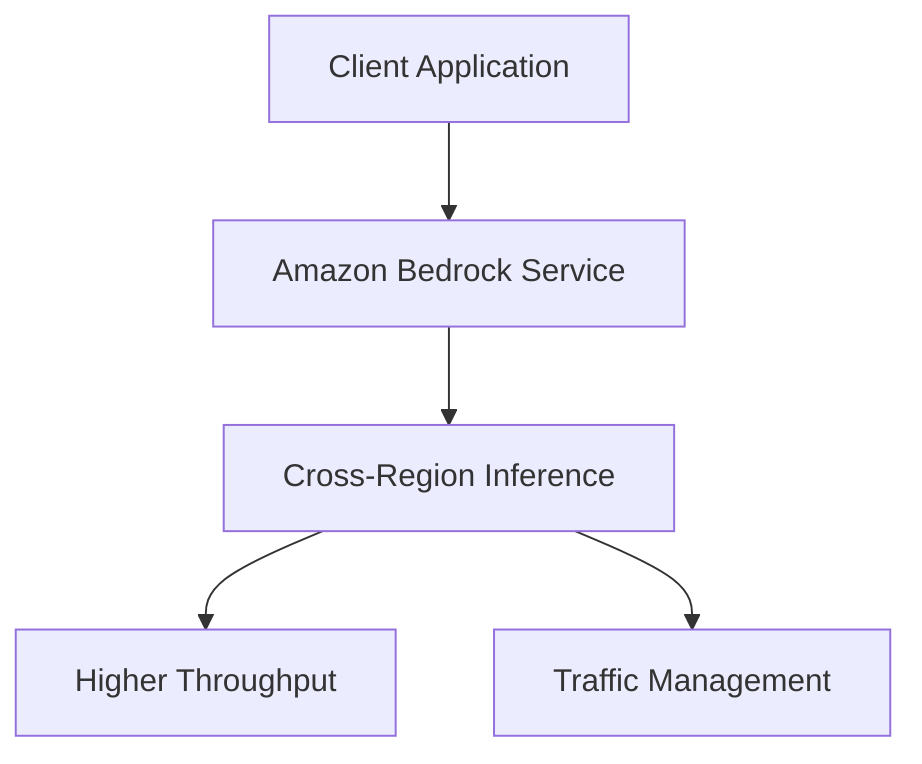

# Amazon Bedrock Workshop - 07_Cross_Region_Inference Module Analysis

## Executive Summary

# Scalable inference with Amazon Bedrock
Amazon Bedrock provides easy access to leading foundation models from multiple model providers. Bedrock offers various inference mechanisms to consume these models. Following different types are available in Bedrock:
* On-demand inference – The standard option for inference. Involves invoking a model in a specific AWS Region.
* Cross-region inference – The opt-in feature allowing access to foundation models beyond a single region. It involves invoking an inference profile, an abstraction over foundation models deployed across a set of AWS Regions, to which it can route inference requests. It helps in increasing throughput and improves resiliency by dynamically routing requests (to the regions defined in the inference profile), depending on user traffic and demand.
* Provisioned Throughput – The option to purchase dedicated compute. It involves purchasing a dedicated level of throughput for a model in a specific AWS Region. Provisioned Throughput quotas depend on the number of model units that you purchase.

## Implementation Details Breakdown

### Notebooks

- **Getting_started_with_Cross-region_Inference.ipynb**: Getting started with cross-region inference

### Key Code Samples

#### From Getting_started_with_Cross-region_Inference.ipynb

```python
# Start by installing the dependencies to ensure we have a recent version
#!pip install --quiet --upgrade --force-reinstall boto3 botocore awscli

```

## Technical Architecture Overview



## Key Takeaways and Lessons Learned

1. **Module Focus**: This module demonstrates 07 Cross Region Inference capabilities in Amazon Bedrock.

2. **Integration Patterns**: The examples show how to integrate Amazon Bedrock services into applications.

3. **Best Practices**: The code demonstrates recommended patterns for working with Amazon Bedrock APIs.

## Recommendations and Next Steps

1. **Explore Further**: Experiment with different parameters and configurations to understand their impact.

2. **Combine Capabilities**: Consider how the capabilities demonstrated in this module can be combined with other Amazon Bedrock features.

3. **Production Considerations**: When moving to production, consider aspects like error handling, monitoring, and scaling.

