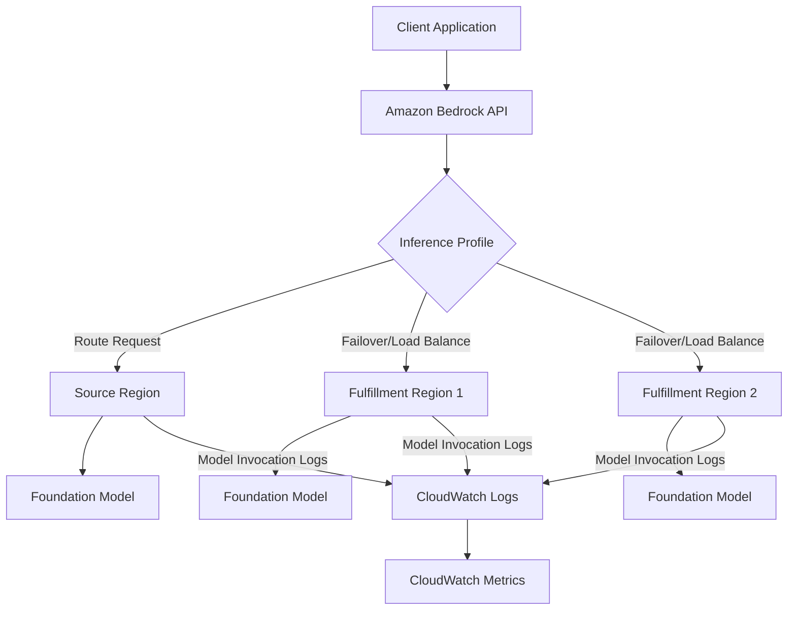
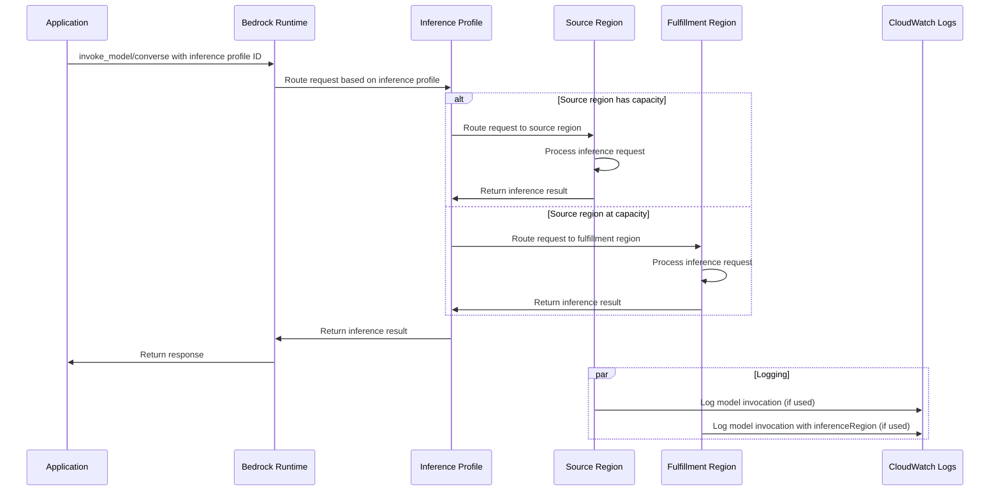

# SUMMARY-07_Cross_Region_Inference.md

## Executive Summary

This module introduces Amazon Bedrock's Cross-Region Inference feature, which enables applications to access foundation models across multiple AWS regions rather than being limited to a single region. The implementation demonstrates how to use inference profiles to route model requests dynamically across configured regions, improving throughput and resilience. The module provides practical examples of using cross-region inference with both the Converse API and InvokeModel API, as well as integration with LangChain. It also covers monitoring and logging capabilities to track cross-region inference usage.

## Implementation Details Breakdown

### Core Components

1. **Inference Profiles**
   - Abstraction layer over foundation models deployed across multiple AWS regions
   - Enables dynamic routing of inference requests based on traffic and demand
   - No additional cost beyond standard model pricing

2. **Two Types of Cross-Region Inference**
   - **Foundation model in source region**: Acts as a failover mechanism, routing requests to other regions when the source region is busy or at quota limits
   - **Available via Inference Profiles**: Select models made available across pre-defined region sets, with Amazon Bedrock abstracting away regional details

3. **API Integration**
   - Compatible with existing Bedrock APIs (Converse and InvokeModel)
   - Two new APIs added:
     - `list_inference_profiles()`: Lists all models configured behind Inference Profiles
     - `get_inference_profile(inferenceProfileIdentifier)`: Provides details about a specific Inference Profile

4. **Model Identification**
   - Inference profiles have distinct identifiers with regional prefixes (e.g., `us.` or `eu.`)
   - ARN format changes from `:<region>::foundation-model/<model-id>` to `:<region>::inference-profile/<region-set-prefix>.<model-id>`

5. **LangChain Integration**
   - Support for cross-region inference through LangChain's AWS integration
   - Examples using `ChatBedrockConverse` and `ChatBedrock` classes

6. **Monitoring and Logging**
   - Integration with CloudWatch for tracking cross-region inference usage
   - Custom metric filters to identify when requests are routed to fulfillment regions

### Code Implementation

The module uses boto3 to interact with Amazon Bedrock services. Here's a breakdown of the key implementation patterns:

1. **Client Setup**
```python
bedrock_client = get_boto_client(service_name='bedrock', region=region_name)
bedrock_runtime = get_boto_client(service_name='bedrock-runtime', region=region_name)
```

2. **Listing Available Inference Profiles**
```python
bedrock_client.list_inference_profiles()['inferenceProfileSummaries']
```

3. **Getting Details of a Specific Inference Profile**
```python
bedrock_client.get_inference_profile(
    inferenceProfileIdentifier='us.anthropic.claude-3-5-sonnet-20240620-v1:0'
)
```

4. **Using Converse API with Inference Profile**
```python
response = bedrock_runtime.converse(
    modelId='us.anthropic.claude-3-haiku-20240307-v1:0',  # Inference Profile ID
    system=[{"text": system_prompt}],
    messages=[{
        "role": "user",
        "content": [{"text": input_message}]
    }]
)
```

5. **Using InvokeModel API with Inference Profile**
```python
response = bedrock_runtime.invoke_model(
    body=body, 
    modelId='us.anthropic.claude-3-sonnet-20240229-v1:0',  # Inference Profile ID
    accept=accept, 
    contentType=contentType
)
```

6. **LangChain Integration**
```python
llm = ChatBedrockConverse(
    model='us.anthropic.claude-3-sonnet-20240229-v1:0',  # Inference Profile ID
    temperature=0,
    max_tokens=None,
    client=bedrock_runtime,
)
```

7. **Setting Up Monitoring and Logging**
```python
# Create IAM role for logging
# Configure CloudWatch log group
# Enable model invocation logging
bedrock_client.put_model_invocation_logging_configuration(
    loggingConfig={
        'cloudWatchConfig': {
            'logGroupName': log_group_name,
            'roleArn': f"arn:aws:iam::{account_id}:role/{role_name}",
        },
        'imageDataDeliveryEnabled': False,
        'embeddingDataDeliveryEnabled': False,
    }
)

# Create metric filter to track cross-region routing
logs_client.put_metric_filter(
    logGroupName=log_group_name,
    filterName='bedrock_cross_region_inference_rerouted',
    filterPattern=f'{{ $.inferenceRegion != "{region_name}" }}',
    metricTransformations=[...]
)
```

## Key Takeaways and Lessons Learned

1. **Simplified Scaling and Resilience**
   - Cross-region inference eliminates the need to build complex resilience architectures
   - Automatically handles traffic bursts by routing to regions with available capacity
   - Provides higher throughput for generative AI workloads without additional infrastructure

2. **Seamless API Integration**
   - Uses the same APIs as standard Bedrock models (Converse and InvokeModel)
   - Only requires changing the model ID to use an inference profile
   - Compatible with existing applications and frameworks like LangChain

3. **Cost Efficiency**
   - No additional cost beyond standard model pricing
   - Helps avoid throttling during peak usage by accessing capacity across regions

4. **Monitoring Capabilities**
   - Model invocation logs track which region processed each request
   - Custom CloudWatch metrics can monitor cross-region routing patterns

5. **Considerations and Limitations**
   - Potential latency impacts when requests are routed to distant regions
   - Compliance considerations when data may be processed in different regions
   - No control over exactly which region processes a specific request
   - Limited to pre-defined region sets configured by AWS

## Technical Architecture Overview



### Request/Response Flow for Cross-Region Inference



## Recommendations and Next Steps

1. **Performance Testing**
   - Conduct thorough latency testing when implementing cross-region inference
   - Compare response times between direct model invocation and inference profiles
   - Establish baseline metrics for monitoring in production

2. **Compliance Validation**
   - Review the pre-defined region sets in inference profiles for compliance with data residency requirements
   - Consider using direct foundation models if strict regional control is required

3. **Monitoring Implementation**
   - Set up CloudWatch dashboards to track cross-region routing patterns
   - Create alarms for unexpected changes in routing behavior
   - Monitor latency differences between regions

4. **Graceful Degradation**
   - Design applications to handle potential latency variations when requests are routed to different regions
   - Implement timeouts and retry logic appropriate for cross-region scenarios

5. **Cost Analysis**
   - Monitor usage patterns across regions to understand cost implications
   - Compare throughput and availability benefits against any potential latency impacts

6. **Advanced Integration**
   - Explore combining cross-region inference with other Bedrock features like provisioned throughput
   - Consider hybrid approaches for different workload types based on latency sensitivity

7. **Cleanup Considerations**
   - Remember to disable model invocation logging when not needed to avoid associated costs
   - Review and clean up IAM roles created for logging if they're no longer required

By implementing cross-region inference, applications can achieve higher throughput, better resilience to traffic spikes, and improved availability without the complexity of managing cross-region infrastructure manually.

## Token Utilization Summary

- **Prompt Length**: 28295 characters
- **Estimated Token Count**: ~7073 tokens
- **Context Window Utilization**: ~3.5% of 200K token context window


---

*This summary was generated by Claude 3.7 Sonnet from Anthropic on 2025-07-06 at 17:48:35.*
