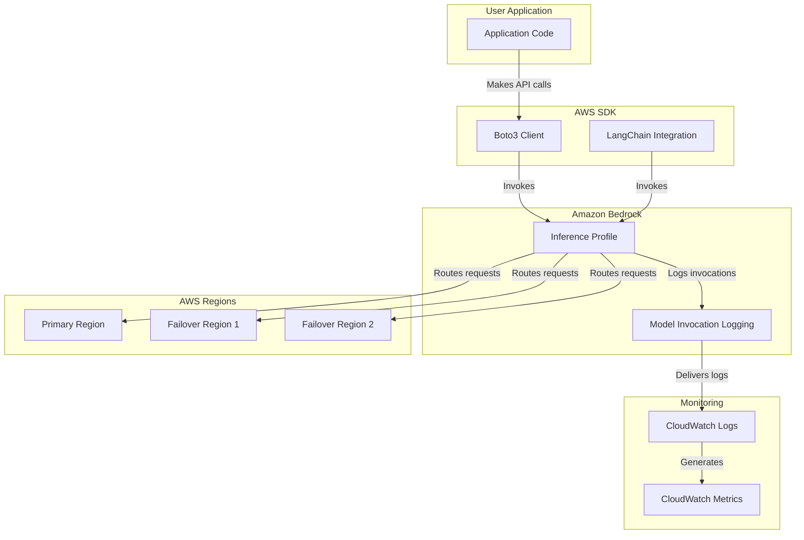
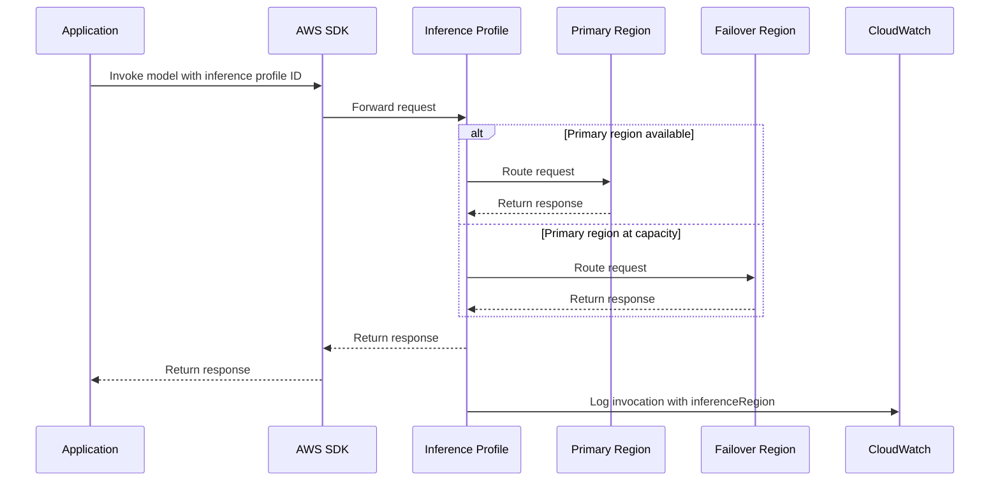

# Amazon Bedrock Cross-Region Inference - Technical Summary

## Executive Summary

Amazon Bedrock Cross-Region Inference is a feature that enables applications to access foundation models beyond a single AWS region, improving throughput and resiliency by dynamically routing inference requests across multiple regions. This module demonstrates how to use inference profiles, which are abstractions over foundation models deployed across a set of AWS regions. The implementation showcases how to list available inference profiles, retrieve their details, and invoke models using both the Converse API and InvokeModel API. Additionally, it demonstrates integration with LangChain, a popular open-source framework for building generative AI applications, and provides guidance on monitoring, logging, and metrics for cross-region inference.

## Technical Architecture Overview



## Implementation Details Breakdown

### 1. Setting Up the Environment

The implementation begins with setting up the necessary AWS clients for interacting with Amazon Bedrock:

```python
import boto3
from botocore.config import Config

def get_boto_client(
    assumed_role=None,
    region=None,
    runtime=True,
    service_name=None,
):
    # Configuration for the boto3 client
    if region is None:
        target_region = os.environ.get("AWS_REGION", os.environ.get("AWS_DEFAULT_REGION"))
    else:
        target_region = region
        
    # Create retry configuration
    retry_config = Config(
        region_name=target_region,
        retries={
            "max_attempts": 10,
            "mode": "standard",
        },
    )
    
    # Create session and client
    session = boto3.Session(region_name=target_region)
    
    if not service_name:
        if runtime:
            service_name='bedrock-runtime'
        else:
            service_name='bedrock'
            
    bedrock_client = session.client(
        service_name=service_name,
        config=retry_config
    )
    
    return bedrock_client
```

This helper function creates a boto3 client for Amazon Bedrock with appropriate configuration, including retry settings and region selection.

### 2. Understanding Inference Profiles

The module demonstrates how to list and retrieve information about available inference profiles:

```python
# List all available inference profiles
bedrock_client.list_inference_profiles()['inferenceProfileSummaries']

# Get details about a specific inference profile
bedrock_client.get_inference_profile(
    inferenceProfileIdentifier='us.anthropic.claude-3-5-sonnet-20240620-v1:0'
)
```

Key concepts explained:

1. **Foundation model in source region**: Inference profiles configured for models that exist in the source region, providing failover capability to other regions when needed.

2. **Available via Inference Profiles**: Select models made available exclusively through inference profiles, where Amazon Bedrock abstracts away regional details and manages hosting and routing automatically.

### 3. Using Inference Profiles with Converse API

The module demonstrates how to use inference profiles with the Converse API, which provides a unified messaging interface for foundation models:

```python
# Using a foundation model directly
response = bedrock_runtime.converse(
    modelId='anthropic.claude-3-haiku-20240307-v1:0',
    system=[{"text": system_prompt}],
    messages=[{
        "role": "user",
        "content": [{"text": input_message}]
    }]
)

# Using an inference profile
response = bedrock_runtime.converse(
    modelId='us.anthropic.claude-3-haiku-20240307-v1:0',
    system=[{"text": system_prompt}],
    messages=[{
        "role": "user",
        "content": [{"text": input_message}]
    }]
)
```

The code shows that using an inference profile is as simple as changing the model ID to include a regional prefix (e.g., `us.`).

### 4. Using Inference Profiles with InvokeModel API

For applications built on the InvokeModel API, the module demonstrates how to use inference profiles:

```python
import json

body = json.dumps({
    "anthropic_version": "bedrock-2023-05-31",
    "max_tokens": 1024,
    "temperature": 0.1,
    "top_p": 0.9,
    "system": system_prompt,
    "messages": [
        {
            "role": "user",
            "content": [
                {
                    "type": "text",
                    "text": f"{input_message}",
                }
            ]
        }
    ]
})

# Using a foundation model directly
response = bedrock_runtime.invoke_model(
    body=body, 
    modelId='anthropic.claude-3-sonnet-20240229-v1:0', 
    accept='application/json', 
    contentType='application/json'
)

# Using an inference profile
response = bedrock_runtime.invoke_model(
    body=body, 
    modelId='us.anthropic.claude-3-sonnet-20240229-v1:0', 
    accept='application/json', 
    contentType='application/json'
)
```

This demonstrates that the InvokeModel API works seamlessly with inference profiles, requiring only a change in the model ID.

### 5. LangChain Integration

The module shows how to use inference profiles with LangChain, a popular framework for building generative AI applications:

```python
from langchain_aws import ChatBedrockConverse

# Using ChatBedrockConverse with an inference profile
llm = ChatBedrockConverse(
    model='us.anthropic.claude-3-sonnet-20240229-v1:0',
    temperature=0,
    max_tokens=None,
    client=bedrock_runtime,
)

# Using ChatBedrock with an inference profile
from langchain_aws import ChatBedrock

llm = ChatBedrock(
    model_id='us.anthropic.claude-3-sonnet-20240229-v1:0',
    beta_use_converse_api=True,  
    client=bedrock_runtime,
    region_name='us-east-1'
)
```

The implementation demonstrates two approaches:
1. Using `ChatBedrockConverse` which leverages the Converse API
2. Using `ChatBedrock` with the `beta_use_converse_api` flag set to true

### 6. Monitoring, Logging, and Metrics

The module provides code for setting up monitoring and logging for cross-region inference:

```python
# Enable model invocation logging to CloudWatch
response = bedrock_client.put_model_invocation_logging_configuration(
    loggingConfig={
        'cloudWatchConfig': {
            'logGroupName': log_group_name,
            'roleArn': f"arn:aws:iam::{account_id}:role/{role_name}",
        },
        'imageDataDeliveryEnabled': False,
        'embeddingDataDeliveryEnabled': False,
    }
)

# Create a CloudWatch metric filter to track cross-region routing
logs_client.put_metric_filter(
    logGroupName=log_group_name,
    filterName='bedrock_cross_region_inference_rerouted',
    filterPattern=f'{{ $.inferenceRegion != "{region_name}" }}',
    metricTransformations=[
        {
            'metricNamespace': 'Custom',
            'metricName': 'bedrock_cross_region_inference_rerouted',
            'metricValue': '1',
            'defaultValue': 0,
            'unit': 'Count',
        }
    ]
)
```

This setup enables tracking of which region handles each inference request, allowing for monitoring of cross-region routing patterns.

## Key Takeaways and Lessons Learned

1. **Seamless API Integration**: Cross-region inference works with existing APIs (Converse and InvokeModel) without requiring code changes beyond updating the model ID.

2. **Regional Prefixes**: Inference profile IDs are distinguished by regional prefixes (e.g., `us.` or `eu.`) in the model ID.

3. **Automatic Routing**: Amazon Bedrock intelligently routes requests to regions with available capacity, improving resilience and throughput.

4. **Monitoring Capabilities**: The `inferenceRegion` field in model invocation logs allows tracking which region processed each request.

5. **Framework Compatibility**: Popular frameworks like LangChain can easily integrate with cross-region inference.

6. **No Additional Cost**: Cross-region inference is available at no additional cost beyond standard model pricing.

7. **Consistent Experience**: The end-user experience remains the same regardless of which region processes the request.

## Technical Recommendations and Next Steps

1. **Latency Considerations**:
   - Test cross-region inference thoroughly if your application is latency-sensitive
   - Consider the potential impact of increased latency on user experience
   - Implement client-side timeouts appropriate for cross-region scenarios

2. **Compliance Requirements**:
   - Review the pre-defined region sets to ensure they align with your compliance requirements
   - If certain regions are prohibited by your policies, consider using foundation models directly instead of inference profiles

3. **Monitoring Strategy**:
   - Implement CloudWatch dashboards to track cross-region routing patterns
   - Set up alarms for unusual routing behavior or increased latency
   - Consider implementing custom metrics to track performance by region

4. **Error Handling**:
   - Implement robust error handling to manage potential failures across regions
   - Consider implementing circuit breakers for regions experiencing persistent issues
   - Test failure scenarios to ensure graceful degradation

5. **Performance Optimization**:
   - Benchmark performance across different regions to understand latency patterns
   - Consider implementing caching strategies to reduce the need for cross-region calls
   - Explore batching requests where appropriate to improve efficiency

## Sequence Diagram for Cross-Region Inference



## Conclusion

Amazon Bedrock Cross-Region Inference provides a powerful mechanism for improving the resilience and scalability of generative AI applications. By abstracting away the complexities of regional deployment and routing, it allows developers to focus on building differentiated applications rather than managing infrastructure. The feature works seamlessly with existing APIs and popular frameworks, making it easy to adopt without significant code changes.

The key benefits of cross-region inference include increased throughput, improved resilience to traffic bursts, and access to region-agnostic models. However, developers should carefully consider latency requirements, compliance constraints, and the need for deterministic routing when deciding whether to use inference profiles.

With proper monitoring and logging in place, cross-region inference can provide valuable insights into application performance and usage patterns, enabling continuous optimization and improvement of generative AI applications.
