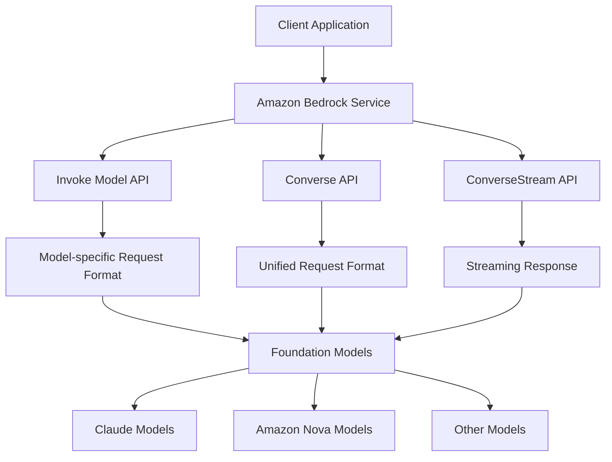
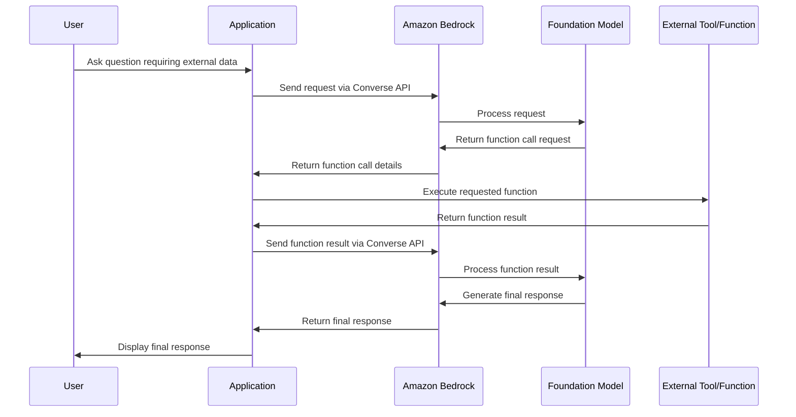

# SUMMARY-01_Text_generation.md

## Executive Summary

This module introduces Amazon Bedrock's text generation capabilities through a comprehensive Jupyter notebook that explores both the basic Invoke API and the more powerful Converse API. The workshop demonstrates how to use foundation models for text summarization, code generation, and function calling. Key features include multi-turn conversations, streaming responses, and cross-regional inference. The module showcases how to work with various foundation models like Claude 3.7 Sonnet, Claude 3.5 Sonnet, Amazon Nova, and others through a unified API interface, allowing developers to easily switch between models while maintaining the same code structure.

## Implementation Details Breakdown

### 1. Setup and Configuration

The module begins with importing necessary libraries and setting up the Bedrock client:

```python
import json
import boto3
import botocore
from IPython.display import display, Markdown
import time

# Initialize Bedrock client
session = boto3.session.Session()
region = session.region_name
bedrock = boto3.client(service_name='bedrock-runtime', region_name=region)
```

A dictionary of model IDs is defined to facilitate easy switching between different foundation models:

```python
MODELS = {
    "Claude 3.7 Sonnet": "us.anthropic.claude-3-7-sonnet-20250219-v1:0",
    "Claude 3.5 Sonnet": "us.anthropic.claude-3-5-sonnet-20240620-v1:0",
    "Claude 3.5 Haiku": "us.anthropic.claude-3-5-haiku-20241022-v1:0",
    "Amazon Nova Pro": "us.amazon.nova-pro-v1:0",
    "Amazon Nova Micro": "us.amazon.nova-micro-v1:0",
    "DeepSeek-R1": "us.deepseek.r1-v1:0",
    "Meta Llama 3.1 70B Instruct": "us.meta.llama3-1-70b-instruct-v1:0"
}
```

### 2. Text Summarization Implementation

#### Invoke Model API

The module first demonstrates text summarization using the basic Invoke Model API, which requires model-specific request formats:

```python
claude_body = json.dumps({
    "anthropic_version": "bedrock-2023-05-31",
    "max_tokens": 1000,
    "temperature": 0.5,
    "top_p": 0.9,
    "messages": [
        {
            "role": "user",
            "content": [{"type": "text", "text": prompt}]
        }
    ],
})

response = bedrock.invoke_model(
    modelId=MODELS["Claude 3.7 Sonnet"],
    body=claude_body,
    accept="application/json",
    contentType="application/json"
)
```

#### Converse API

The module then introduces the Converse API, which provides a unified interface across all models:

```python
converse_request = {
    "messages": [
        {
            "role": "user",
            "content": [
                {
                    "text": f"Please provide a concise summary of the following text in 2-3 sentences. Text to summarize: {text_to_summarize}"
                }
            ]
        }
    ],
    "inferenceConfig": {
        "temperature": 0.4,
        "topP": 0.9,
        "maxTokens": 500
    }
}

response = bedrock.converse(
    modelId=MODELS["Claude 3.7 Sonnet"],
    messages=converse_request["messages"],
    inferenceConfig=converse_request["inferenceConfig"]
)
```

### 3. Model Switching and Cross-Regional Inference

The module demonstrates how to easily switch between different foundation models using the same Converse API request format:

```python
for model_name, model_id in MODELS.items():
    response = bedrock.converse(
        modelId=model_id,
        messages=converse_request["messages"],
        inferenceConfig=converse_request["inferenceConfig"]
    )
```

Cross-Regional Inference is implemented by simply using model IDs with regional prefixes:

```python
# Regular model invocation
standard_response = bedrock.converse(
    modelId="anthropic.claude-3-5-sonnet-20240620-v1:0",
    messages=converse_request["messages"]
)

# Cross-region inference (with "us." prefix)
cris_response = bedrock.converse(
    modelId="us.anthropic.claude-3-5-sonnet-20240620-v1:0",
    messages=converse_request["messages"]
)
```

### 4. Multi-turn Conversations

The module shows how to implement multi-turn conversations by maintaining a message history:

```python
multi_turn_messages = [
    {
        "role": "user",
        "content": [{"text": f"Please summarize this text: {text_to_summarize}"}]
    },
    {
        "role": "assistant",
        "content": [{"text": results["Claude 3.7 Sonnet"]["response"]}]
    },
    {
        "role": "user",
        "content": [{"text": "Can you make this summary even shorter, just 1 sentence?"}]
    }
]

response = bedrock.converse(
    modelId=MODELS["Claude 3.7 Sonnet"],
    messages=multi_turn_messages,
    inferenceConfig={"temperature": 0.2, "maxTokens": 500}
)
```

### 5. Streaming Responses

For longer generations, the module demonstrates how to use the ConverseStream API to receive content incrementally:

```python
response = bedrock.converse_stream(
    modelId=model_id,
    messages=messages,
    inferenceConfig=inference_config
)
response_stream = response.get('stream')
if response_stream:
    for event in response_stream:
        if 'contentBlockDelta' in event:
            print(event['contentBlockDelta']['delta']['text'], end="")
```

### 6. Code Generation

The module shows how to use foundation models to generate code:

```python
code_generation_prompt = """
Create a Python function called get_weather that accepts a location as parameter. \
The function should return a dictionary containing weather data...
"""

response = bedrock.converse(
    modelId=MODELS["Claude 3.7 Sonnet"],
    messages=[{"role": "user", "content": [{"text": code_generation_prompt}]}],
    inferenceConfig={"temperature": 0.0, "topP": 0.9, "maxTokens": 500}
)
```

### 7. Function Calling

The module demonstrates how to implement function calling with the Converse API:

```python
weather_tool = {
    "tools": [
        {
            "toolSpec": {
                "name": "get_weather",
                "description": "Get current weather for a specific location",
                "inputSchema": {
                    "json": {
                        "type": "object",
                        "properties": {
                            "location": {
                                "type": "string",
                                "description": "The city name to get weather for"
                            }
                        },
                        "required": ["location"]
                    }
                }
            }
        }
    ],
    "toolChoice": {
        "auto": {}  # Let the model decide when to use the tool
    }
}

response = bedrock.converse(
    modelId=MODELS["Claude 3.7 Sonnet"],
    messages=function_request["messages"],
    inferenceConfig=function_request["inferenceConfig"],
    toolConfig=weather_tool
)
```

A complete function calling flow is implemented with the following steps:
1. Send initial request to the model
2. Check if the model wants to use a tool
3. Execute the requested tool
4. Send the tool result back to the model
5. Get the final response

## Key Takeaways and Lessons Learned

1. **Unified API Interface**: The Converse API provides a consistent interface across all supported models, making it easier to switch between different foundation models without changing code structure.

2. **Model Flexibility**: Different models have different strengths and capabilities. The module demonstrates how to easily compare results across models to find the best fit for specific use cases.

3. **Streaming Benefits**: For longer generations, streaming responses provide a better user experience by showing content as it's generated rather than waiting for the complete response.

4. **Function Calling Pattern**: The function calling implementation follows a clear pattern:
   - Model identifies when a tool should be used
   - Application executes the tool
   - Result is passed back to the model
   - Model generates a final response incorporating the tool's output

5. **Cross-Regional Inference**: Simply using model IDs with regional prefixes enables cross-regional inference, which provides higher throughput limits and better resilience during traffic bursts.

## Technical Architecture Overview



### Function Calling Sequence Diagram



## Recommendations or Next Steps

1. **Experiment with Different Models**: Try different foundation models for your specific use cases to find the best performance and cost balance.

2. **Implement Error Handling**: Add robust error handling for function calling, especially for external API calls that might fail.

3. **Optimize Streaming Implementation**: For production applications, implement a more sophisticated streaming UI that shows typing indicators and handles partial responses gracefully.

4. **Explore Advanced Prompting Techniques**: Experiment with different system prompts and instruction formats to improve model outputs.

5. **Implement Caching**: For frequently requested information, implement a caching layer to reduce API calls and improve response times.

6. **Evaluate Cross-Regional Inference**: Test the performance benefits of cross-regional inference for your specific workloads, especially if you expect traffic bursts.

7. **Extend Function Calling**: Build more complex tools that can be called by the model, such as database queries, API integrations, or computational tools.

8. **Implement Guardrails**: Add guardrails to ensure model outputs meet your application's safety and quality requirements.

## Token Utilization Summary

- **Prompt Length**: 36292 characters
- **Estimated Token Count**: ~9073 tokens
- **Context Window Utilization**: ~4.5% of 200K token context window


---

*This summary was generated by Claude 3.7 Sonnet from Anthropic on 2025-07-06 at 17:41:10.*