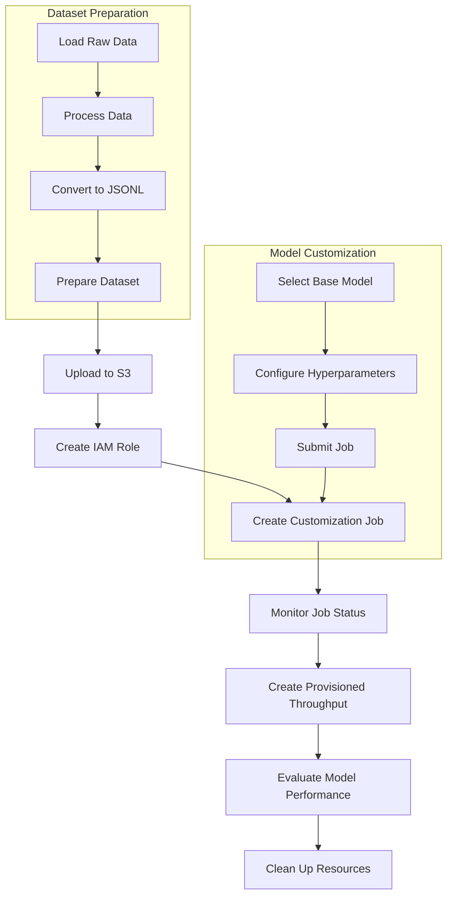
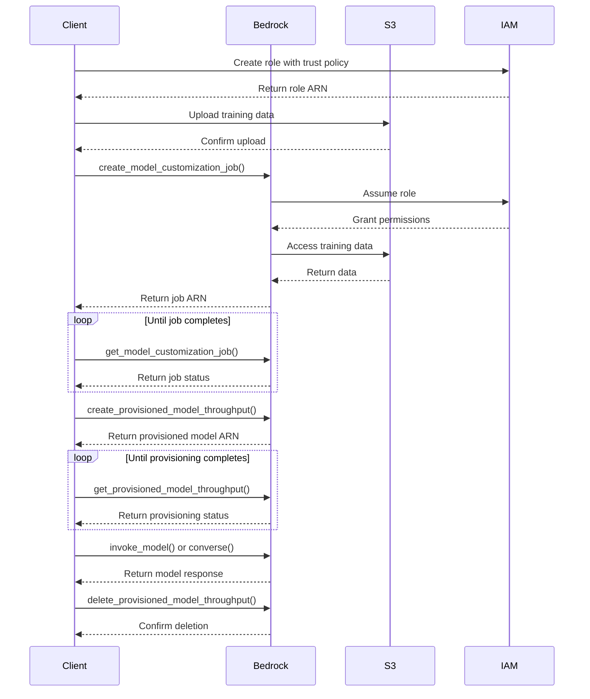

# SUMMARY-03_Model_customization.md

## Executive Summary

This module focuses on model customization in Amazon Bedrock, covering two main approaches: fine-tuning and continued pre-training. The codebase demonstrates how to customize foundation models to improve their performance for specific use cases using private data. The module includes comprehensive examples for fine-tuning Amazon Nova, Claude Haiku, and Meta Llama 3.2 models, as well as continued pre-training for Amazon Titan Text. Each example follows a similar workflow: setting up the environment, preparing datasets, creating customization jobs, provisioning throughput for the customized model, and evaluating performance.

## Implementation Details Breakdown

### 1. Setup and Prerequisites

Each notebook begins with a setup phase that includes:
- Installing required libraries
- Setting up AWS clients (Bedrock, S3, IAM)
- Creating IAM roles with appropriate permissions
- Creating S3 buckets for storing training data and model outputs

The setup process creates a trust relationship allowing Bedrock to assume a role with access to the S3 bucket containing training data.

### 2. Dataset Preparation

Different approaches are used depending on the model and customization type:

- **Fine-tuning datasets**: Formatted as JSONL files with specific structures:
  - For Amazon Nova and Claude Haiku: Message-based format with system, user, and assistant messages
  - For Meta Llama 3.2: Multimodal data with text and images
  
- **Continued pre-training datasets**: Unlabeled text data in JSONL format with only "input" fields

Example datasets include:
- CNN/Daily Mail news articles for summarization tasks
- SAMSUM dataset for conversation summarization
- LLaVA-Instruct dataset for multimodal vision tasks
- AWS CLI documentation for domain-specific continued pre-training

### 3. Customization Job Creation

The core of the implementation is creating customization jobs using the `create_model_customization_job` API:

```python
response = bedrock.create_model_customization_job(
    customizationType="FINE_TUNING",  # or "CONTINUED_PRE_TRAINING"
    jobName=job_name,
    customModelName=model_name,
    roleArn=role_arn,
    baseModelIdentifier=base_model_id,
    hyperParameters=hyper_parameters,
    trainingDataConfig={"s3Uri": s3_train_uri},
    validationDataConfig=validation_data_config,  # Optional
    outputDataConfig={"s3Uri": output_s3_uri}
)
```

Hyperparameters vary by model but typically include:
- `epochCount`: Number of training iterations (1-10)
- `batchSize`: Number of samples processed before updating model parameters
- `learningRate`: Rate at which model parameters are updated

### 4. Provisioning Throughput

After customization, models require provisioned throughput for inference:

```python
provisioned_model_id = bedrock.create_provisioned_model_throughput(
    modelUnits=1,
    provisionedModelName=provisioned_model_name,
    modelId=custom_model_id
)
```

This allocates dedicated capacity for the model, measured in Model Units (MU).

### 5. Model Evaluation

Each notebook includes evaluation code to compare the customized model against the base model:
- For text generation: Comparing responses to the same prompts
- For summarization: Using metrics like BERTScore to evaluate summary quality
- For multimodal tasks: Testing image understanding capabilities

### 6. Resource Cleanup

All notebooks include cleanup steps to delete provisioned throughput and other resources to avoid unnecessary costs.

## Key Takeaways and Lessons Learned

1. **Model Customization Benefits**:
   - Fine-tuning improves model performance on specific tasks by providing labeled examples
   - Continued pre-training enhances domain knowledge using unlabeled data

2. **Data Format Importance**:
   - Each model requires specific data formats for optimal training
   - Quality and quantity of training data significantly impact customization results

3. **Resource Management**:
   - Provisioned throughput is required for inference but incurs costs even when idle
   - Customization jobs have specific quotas and limitations (e.g., max 10,000 training records for fine-tuning)

4. **Performance Considerations**:
   - Customization jobs can take several hours to complete
   - Even small datasets can yield noticeable improvements in model performance

5. **Hyperparameter Selection**:
   - Different models have different hyperparameter ranges and defaults
   - Proper hyperparameter tuning can significantly impact customization results

## Technical Architecture Overview



### API Interaction Sequence



## Recommendations and Next Steps

1. **Dataset Optimization**:
   - Use larger, more diverse datasets for better customization results
   - Ensure data quality and relevance to the target domain
   - Consider data augmentation techniques to improve model robustness

2. **Hyperparameter Tuning**:
   - Experiment with different hyperparameter configurations
   - Consider using validation loss to guide hyperparameter selection
   - Monitor training metrics to identify overfitting or underfitting

3. **Cost Management**:
   - Delete provisioned throughput when not in use
   - Consider batch processing for large-scale inference tasks
   - Monitor resource usage to optimize costs

4. **Advanced Customization**:
   - Combine fine-tuning and continued pre-training for optimal results
   - Explore multi-stage customization pipelines
   - Implement A/B testing to compare different customization approaches

5. **Production Deployment**:
   - Implement monitoring and logging for customized models
   - Set up automated evaluation pipelines
   - Consider model versioning and rollback strategies

6. **Multimodal Expansion**:
   - Explore customization of multimodal models for specialized tasks
   - Combine text and image data for richer training experiences
   - Develop domain-specific multimodal applications

By following these recommendations, organizations can maximize the benefits of model customization in Amazon Bedrock and create more effective, domain-specific AI applications.

## Token Utilization Summary

- **Prompt Length**: 104805 characters
- **Estimated Token Count**: ~26201 tokens
- **Context Window Utilization**: ~13.1% of 200K token context window


---

*This summary was generated by Claude 3.7 Sonnet from Anthropic on 2025-07-06 at 17:43:52.*