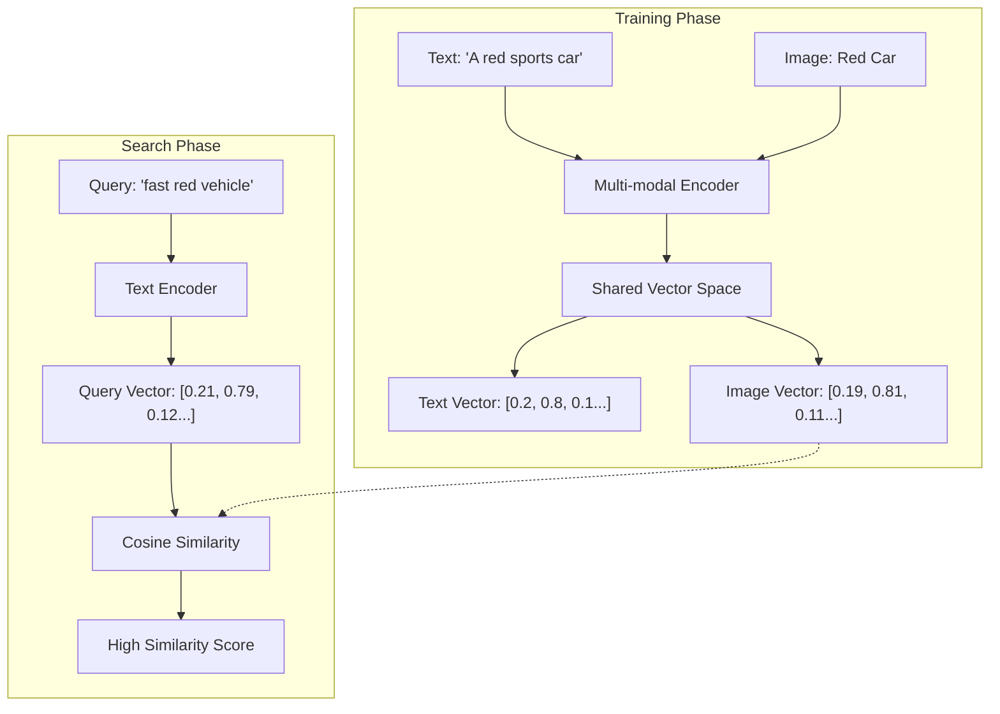
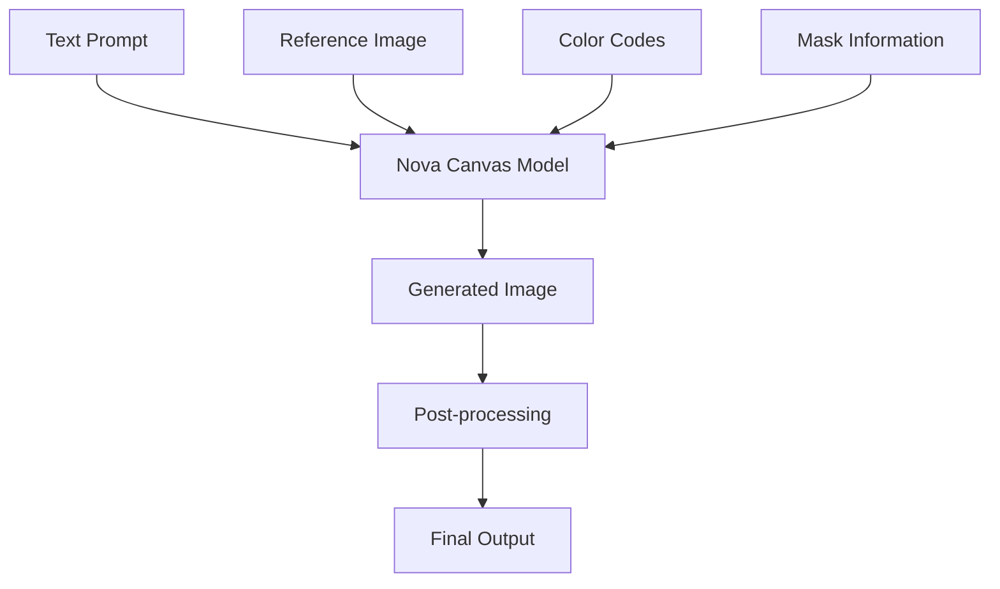
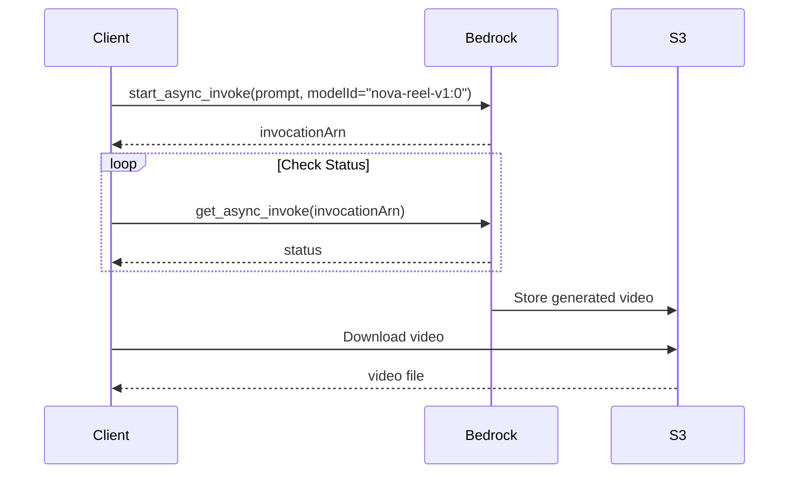

# SUMMARY-04_Image_and_Multimodal.md

## Executive Summary

Module 4 of the Amazon Bedrock Workshop focuses on image generation and multimodal embeddings capabilities. The module consists of three main notebooks that explore different aspects of visual AI:

1. **Titan Multimodal Embeddings**: Demonstrates how to generate and use embeddings for images and text, enabling semantic search and recommendation systems.
2. **Nova Canvas**: Explores image generation capabilities including text-to-image, inpainting, outpainting, color conditioning, and background removal.
3. **Nova Reel**: Showcases video generation from both text prompts and image-text combinations.

The module provides hands-on experience with Amazon Bedrock's foundation models for visual content creation and multimodal understanding, with practical examples for enterprise use cases like e-commerce product search, marketing asset creation, and video advertising.

## Implementation Details Breakdown

### 1. Titan Multimodal Embeddings

The first notebook demonstrates how to use Amazon Titan Multimodal Embedding Models to create and utilize embeddings for both images and text.

**Key Components:**
- **Dataset Creation**: Uses Amazon Bedrock LLMs to generate product descriptions and Titan Image Generator to create corresponding product images
- **Embedding Generation**: Converts images and text into embeddings using the Titan Multimodal Embeddings model
- **Similarity Analysis**: Visualizes embedding relationships using heatmaps to show semantic connections
- **Multimodal Search**: Implements a search function that can find relevant images based on text queries

**Implementation Flow:**
```python
# Generate embeddings for images
multimodal_embeddings = []
for title in titles:
    embedding = titan_multimodal_embedding(image_path=title, dimension=1024)["embedding"]
    multimodal_embeddings.append(embedding)

# Search using text query
query_prompt = "suede sneaker"
query_emb = titan_multimodal_embedding(description=query_prompt, dimension=1024)["embedding"]
idx_returned, dist = search(
    np.array(query_emb)[None], 
    np.array(multimodal_embeddings)
)
```

#### So how does text and image co-relate successfully?

TL;DR 

The key concepts to cover:
1. Shared embedding space - both text and images are mapped to the same vector space
2. How this mapping is learned during training
3. The actual retrieval process
4. Examples of how semantic similarity works across modalities
5. Technical implementation details

Multi-modal embeddings work by mapping both text and images into a **shared vector space** where semantically similar content (regardless of modality) are positioned close together. Here's how it works:

#### **1. Shared Embedding Space**

#### **2. Training Process (Contrastive Learning)**

Models like **CLIP** are trained on millions of image-text pairs:

```python
# Simplified training concept
def contrastive_loss(image_embeddings, text_embeddings):
    # Make matching pairs similar
    positive_similarity = cosine_similarity(image_embed, matching_text_embed)
    
    # Make non-matching pairs dissimilar  
    negative_similarity = cosine_similarity(image_embed, random_text_embed)
    
    # Maximize positive, minimize negative
    loss = -log(positive_similarity) + log(negative_similarity)
    return loss
```

#### **3. Real-World Example**

Let's say you have these images in your knowledge base:

```python
# Image embeddings in vector space
images_db = {
    "sunset_beach.jpg": [0.1, 0.8, 0.3, 0.6, ...],    # Beach sunset
    "mountain_hike.jpg": [0.7, 0.2, 0.9, 0.1, ...],   # Mountain trail
    "city_skyline.jpg": [0.4, 0.1, 0.2, 0.9, ...]    # Urban night scene
}

# Text query gets encoded to similar space
query = "peaceful evening by the water"
query_vector = encode_text(query)  # → [0.12, 0.79, 0.31, 0.58, ...]

# Similarity scores:
# sunset_beach.jpg: 0.94 (HIGH - semantically similar)
# mountain_hike.jpg: 0.23 (LOW - different concept)
# city_skyline.jpg: 0.15 (LOW - urban vs nature)
```

#### **4. Semantic Understanding Across Modalities**

The model learns conceptual relationships:

| Text Query | Why It Matches Image | Learned Concepts |
|------------|---------------------|------------------|
| "furry pet playing" | 🐕 playing fetch | Animal behavior, recreation |
| "morning beverage" | ☕ coffee cup | Time of day, consumption |
| "celebration moment" | 🎂 birthday party | Emotions, social events |
| "transportation vehicle" | 🚲 bicycle | Movement, objects |

#### **5. Technical Implementation**

```python
import numpy as np
from sentence_transformers import SentenceTransformer

# Load multi-modal model (e.g., CLIP-based)
model = SentenceTransformer('clip-ViT-B-32')

def search_images_with_text(query, image_database):
    # Encode text query
    query_embedding = model.encode([query], convert_to_tensor=True)
    
    # Compare with pre-computed image embeddings
    similarities = {}
    for image_path, image_embedding in image_database.items():
        similarity = cosine_similarity(query_embedding, image_embedding)
        similarities[image_path] = similarity.item()
    
    # Return top matches
    return sorted(similarities.items(), key=lambda x: x[1], reverse=True)

# Example usage
results = search_images_with_text(
    "person cooking in kitchen", 
    precomputed_image_embeddings
)
# Returns: [("chef_cooking.jpg", 0.87), ("home_kitchen.jpg", 0.81), ...]
```

#### **6. Key Factors for Accuracy**

##### **Training Data Quality**
- Model trained on millions of diverse image-caption pairs
- Learns nuanced relationships (not just object detection)

##### **Semantic Granularity**
```python
# The model understands different levels of abstraction:
"dog" → matches specific dog images
"pet" → matches dogs, cats, birds, etc.  
"companion animal" → broader semantic match
"golden retriever puppy" → very specific match
```

##### **Contextual Understanding**
- "Apple" → could match 🍎 (fruit) or 💻 (tech) based on context
- "Running" → could match 🏃‍♂️ (person) or 🚗 (engine) based on surrounding words

#### **7. AWS Bedrock Implementation**

```python
# In Bedrock Knowledge Base with multi-modal embeddings
response = bedrock_agent.retrieve(
    knowledgeBaseId='multimodal-kb-123',
    retrievalQuery='sunset over calm water',  # Text query
    retrievalConfiguration={
        'vectorSearchConfiguration': {
            'numberOfResults': 5
        }
    }
)

# Returns ranked results including:
# - Text documents about sunsets
# - Image files of sunset scenes  
# - Mixed content (articles with sunset images)
```

The magic is that the model has learned to map **concepts** rather than just keywords - so "peaceful evening by water" can successfully retrieve a sunset beach image even without exact word matches!


### 2. Nova Canvas

The second notebook explores Amazon Nova Canvas for image generation and manipulation, using a fictional dog food company (Octank) as a case study.

**Key Features Implemented:**
- **Text-to-Image**: Generating product package designs from text descriptions
- **Image Conditioning**: Creating stylized versions while maintaining layout
- **Image Variation**: Transferring style from reference images
- **Inpainting**: Replacing specific elements within an image
- **Color Conditioning**: Generating images with specific color palettes
- **Outpainting**: Expanding images with contextually appropriate content
- **Background Removal**: Isolating product images from backgrounds

**Implementation Example (Text-to-Image):**
```python
body = json.dumps({
    "taskType": "TEXT_IMAGE",
    "textToImageParams": {
        "text": prompt,
        "negativeText": negative_prompts
    },
    "imageGenerationConfig": {
        "numberOfImages": 1,
        "quality": "standard",
        "height": 1024,
        "width": 1024,
        "cfgScale": 7.5,
        "seed": 250
    }
})

response = boto3_bedrock.invoke_model(
    body=body, 
    modelId="amazon.nova-canvas-v1:0",
    accept="application/json", 
    contentType="application/json"
)
```

### 3. Nova Reel

The third notebook demonstrates Amazon Nova Reel for video generation, continuing the Octank dog food marketing use case.

**Key Features:**
- **Text-to-Video**: Creating videos from text descriptions
- **Image-to-Video**: Generating videos that animate or transform input images
- **Asynchronous Processing**: Handling long-running video generation jobs
- **S3 Integration**: Storing and retrieving generated videos

**Implementation Example (Text-to-Video):**
```python
def generate_video_from_text(prompt, s3_output_path):
    model_input = {
        "taskType": "TEXT_VIDEO",
        "textToVideoParams": {
            "text": prompt
        },
        "videoGenerationConfig": {
            "durationSeconds": 6, 
            "fps": 24,
            "dimension": "1280x720",
            "seed": seed_num
        },
    }
    response = bedrock_runtime.start_async_invoke(
        modelId="amazon.nova-reel-v1:0",
        modelInput=model_input,
        outputDataConfig={"s3OutputDataConfig": {"s3Uri": f"s3://{s3_output_path}"}},
    )
    return response['invocationArn']
```

## Key Takeaways and Lessons Learned

1. **Multimodal Understanding**: Foundation models can create unified semantic representations of both images and text, enabling powerful search and recommendation systems.

2. **Prompt Engineering for Images**: Effective prompts for image generation typically include:
   - Type of image (photograph/sketch/painting)
   - Description of content (subject/object/environment)
   - Style specifications (realistic/artistic/specific art style)

3. **Advanced Image Manipulation**: Beyond basic generation, models like Nova Canvas enable sophisticated editing capabilities:
   - Maintaining structural elements while changing styles
   - Targeted editing of specific image regions
   - Expanding images with contextually appropriate content
   - Controlling color schemes

4. **Video Generation Workflow**: Video generation requires:
   - Asynchronous processing due to longer computation times
   - Integration with storage services (S3) for result handling
   - Careful prompt design to control camera movement and scene dynamics

5. **Responsible AI Considerations**: The notebooks demonstrate built-in safeguards against generating inappropriate or copyright-infringing content.

## Technical Architecture Overview

### Multimodal Embeddings Architecture



### Image Generation Architecture



### Video Generation Sequence



## Recommendations or Next Steps

1. **Production Integration**:
   - For multimodal search, integrate with vector databases like Amazon OpenSearch for scalable similarity search
   - Implement caching strategies for frequently accessed embeddings to improve performance
   - Consider batch processing for large-scale image embedding generation

2. **Advanced Use Cases**:
   - Combine multimodal embeddings with recommendation systems for personalized product suggestions
   - Implement A/B testing frameworks to evaluate different image generation prompts
   - Create automated pipelines for content generation and refresh cycles

3. **Performance Optimization**:
   - Experiment with different embedding dimensions (256, 384, 1024) to balance accuracy and latency
   - Implement progressive loading techniques for video content
   - Consider model quantization for edge deployment scenarios

```
TL;DR: Model quantization is a technique to reduce the precision of the numbers (weights and activations) in a neural network model. Instead of using 32-bit floating point numbers, you might use 16-bit, 8-bit, or even lower precision. This helps in several ways:

1. Reduces model size
2. Reduces memory usage
3. Increases inference speed
4. Reduces power consumption
5. Makes deployment on edge devices feasible
```

4. **Responsible AI Practices**:
   - Implement human review workflows for generated content before public release
   - Develop prompt libraries with pre-vetted templates for consistent brand representation
   - Create monitoring systems to track model outputs for drift or unexpected content
```
   HINT: Dont let auto-generated images roll out to production w/o human review
   ```

5. **Extended Capabilities**:
   - Explore fine-tuning options for domain-specific image generation
   - Implement feedback loops where user interactions inform future content generation
   - Investigate multi-step generation pipelines (e.g., text → image → video) for complex content creation

By following these recommendations, organizations can effectively leverage Amazon Bedrock's image and multimodal capabilities to create more engaging, personalized, and efficient visual content experiences.

## Token Utilization Summary

- **Prompt Length**: 55023 characters
- **Estimated Token Count**: ~13755 tokens
- **Context Window Utilization**: ~6.9% of 200K token context window


---

*This summary was generated by Claude 3.7 Sonnet from Anthropic on 2025-07-06 at 17:44:42.*
